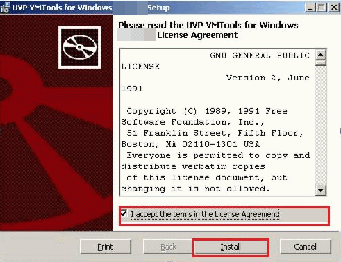
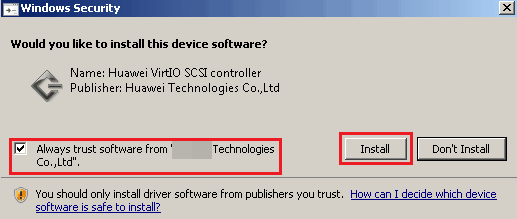
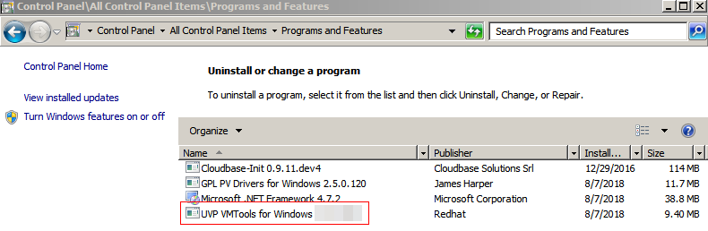

# Windows上安装UVP VMTools

## 操作场景

为了使镜像支持KVM虚拟化，需要在Windows云服务器上安装UVP VMTools。

执行如下命令，检查操作系统中安装的  UVP VMTools的版本信息。

**C:\\Program Files \(x86\)\\virtio\\bin\\version**

-   如果云服务器未安装UVP VMTools，请执行[安装UVP VMTools](#zh-cn_topic_0036684065_section12153337)或[安装UVP VMTools升级包](#section1817195995910)。
-   如果 UVP VMTools的版本低于2.5.0版本，请执行[安装UVP VMTools升级包](#section1817195995910)。
-   如果 UVP VMTools的版本高于或者等于2.5.0版本，则当前UVP VMTools可用。

## 前提条件

-   弹性云服务器已经绑定弹性IP。
-   弹性云服务器已经下载UVP VMTools的安装包，安装包的获取请参考[相关软件及获取方式](相关软件及获取方式.md)。
-   确保弹性云服务器已经预留至少50M的磁盘空间。
-   安装UVP VMTools前，请确保已旧版本的UVP VMTools卸载，否则可能会导致安装失败。
-   卸载旧版本的UVP VMTools后，请先将云服务器重启后再安装最新版本的UVP VMTools。

## 安装UVP VMTools

以使用“vmtools-WIN2008R2-x64.zip”解压得到的“vmtools-WIN2008R2-x64.exe”安装程序为例介绍安装Tools的步骤。

1.  VNC登录Windows弹性云服务器。

    登录云服务器的相关操作请参见《弹性云服务器用户指南》。

2.  根据[相关软件及获取方式](相关软件及获取方式.md)和弹性云服务器的操作系统类型下载对应的UVP VMTools版本。
3.  解压UVP Tools软件包。以使用“vmtools-WIN2008R2-x64.zip”解压得到的“vmtools-WIN2008R2-x64.exe”安装程序为例。
4.  右键单击“vmtools-WIN2008R2-x64.exe”，并选择“以管理员身份运行”，根据界面提示完成安装。
5.  当弹出安装提示窗口时，勾选“I accept the terms in the License Agreement”，单击“Install”。

    **图 1**  安装提示  
    

6.  按提示框进行工具安装，如下所示。
7.  Windows2008 安装步骤为：
    1.  安装过程中可能会弹出Windows安全对话框，如[图2](#fig47401118184018)，请勾选“Always trust...”，单击“Install”，否则将导致安装失败。

        **图 2**  windows安全  
        

    2.  然后点击“Finish”。

8.  请执行[验证安装成功](#zh-cn_topic_0036684065_section42271171)，验证UVP VMTools是否安装成功。

## 安装UVP VMTools升级包

1.  VNC登录Windows弹性云服务器。

    登录云服务器的相关操作请参见《弹性云服务器用户指南》。

2.  下载vmtool-windows.zip升级包。

    下载地址：[https://ecs-instance-driver.obs.myhwclouds.com/vmtools-windows.zip](https://ecs-instance-driver.obs.myhwclouds.com/vmtools-windows.zip)

3.  解压vmtool-windows.zip升级包，得到vmtool-windows.iso升级包。
4.  解压vmtool-windows.iso升级包，单击setup.exe完成升级安装，且vmtool升级包会自动匹配当前操作系统版本。
5.  请执行[验证安装成功](#zh-cn_topic_0036684065_section42271171)，验证UVP VMTools是否安装成功。

## 验证安装成功

如果以下步骤验证成功，则表示UVP VMTools安装成功。

1.  选择“开始 \> 控制面板 \> 程序和功能”。
2.  查看是否存在UVP VMTools信息。

    如果存在则表示安装成功，如[图3](#fig6404346182112)所示。

    **图 3**  设备管理器信息  
    

