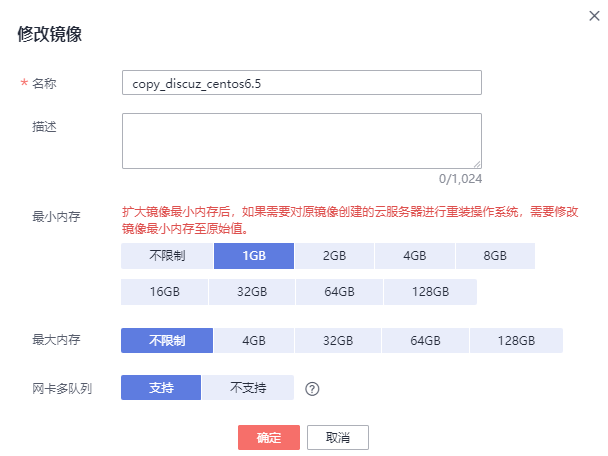

# 修改镜像属性

## 操作场景

为了方便您管理私有镜像，您可以根据需要修改私有镜像的如下信息：

-   镜像的名称
-   描述信息
-   最小内存
-   最大内存
-   是否支持网卡多队列

    开启网卡多队列功能可以将网卡中断分散给不同的CPU处理，实现负载均衡。了解更多信息，请参见“[如何设置镜像的网卡多队列属性？](https://support.huaweicloud.com/ims_faq/ims_faq_0030.html)”。

-   SRIOV驱动

    SRIOV驱动可以极大提高云服务器的网络处理性能。必须在镜像中安装SRIOV驱动，才可以设置为“支持”，否则可能引起云服务器网络不通。安装指导请参见[SRIOV驱动](安装Linux特殊驱动.md#section94756508515)。

## 约束与限制

-   只有状态是“正常”的私有镜像才允许用户修改属性。
-   数据盘镜像仅支持修改名称和描述信息。

## 操作步骤

用户可以选择以下任意一种方式修改镜像的属性。

**方式1**：

1.  登录IMS控制台。
    1.  登录管理控制台。
    2.  选择“计算 \> 镜像服务”。

        进入镜像服务页面。

2.  单击“私有镜像”页签进入对应的镜像列表。
3.  在镜像所在行的“操作”列下，单击“修改”。
4.  在弹出的“修改镜像”对话框中，修改镜像属性。

    **图 1**  修改镜像属性  
    

**方式2**：

1.  登录IMS控制台。
    1.  登录管理控制台。
    2.  选择“计算 \> 镜像服务”。

        进入镜像服务页面。

2.  单击“私有镜像”页签进入对应的镜像列表。
3.  在镜像列表中，单击镜像名称，进入镜像详情页面。
4.  在镜像详情页面单击“修改”，在弹出的“修改镜像”对话框中，修改镜像属性。

