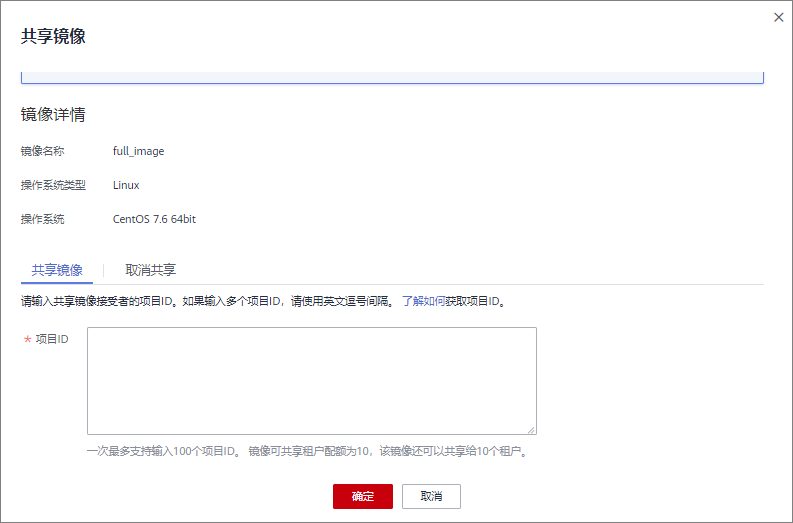

# 共享指定镜像

## 操作场景

用户A获取用户B的项目ID之后，可以将指定的私有镜像共享给用户B。共享镜像可以分为批量镜像共享和单个镜像共享两种方式，用户可以按照需要进行选择。

## 前提条件

-   用户A已获取用户B的项目ID。
-   共享镜像前，请确认私有镜像已清除敏感数据和文件。

## 操作步骤

-   **批量镜像共享**
    1.  用户A登录IMS控制台。
        1.  登录管理控制台。
        2.  选择“计算 \> 镜像服务”。

            进入镜像服务页面。

    2.  单击“私有镜像”页签进入镜像列表页面。
    3.  勾选需要共享的私有镜像，单击镜像列表上方的“共享”。
    4.  在“共享镜像”窗口，输入用户B的项目ID。

        如果需要添加多个镜像接受者，请使用英文逗号间隔。

        > **说明：** 
        >一次最多可以输入100个项目ID。
        >如果用户B是多项目用户，用户A可以将私有镜像共享至用户B在区域下创建的项目。

        **图 1**  共享镜像  
        

    5.  单击“确定”，完成镜像共享。

-   **单个镜像共享**
    1.  用户A登录IMS控制台。
        1.  登录管理控制台。
        2.  选择“计算 \> 镜像服务”。

            进入镜像服务页面。

    2.  单击“私有镜像”页签进入镜像列表页面。
    3.  在需要共享的私有镜像所在行的“操作”列，单击“更多”，选择“共享”。
    4.  在“共享镜像”窗口，输入用户B的项目ID。

        如果需要添加多个镜像接受者，请使用英文逗号间隔。

        > **说明：** 
        >一次最多可以输入100个项目ID。
        >如果用户B是多项目用户，用户A可以将私有镜像共享至用户B在区域下创建的项目。

        **图 2**  共享镜像  
        

    5.  单击“确定”，完成镜像共享。

## 相关操作

用户A成功共享镜像后，用户B可以在管理控制台同一区域的“计算 \> 镜像服务 \> 共享镜像”页面接受共享镜像，详细操作请参见[接受或拒绝共享镜像](接受或拒绝共享镜像.md)。

