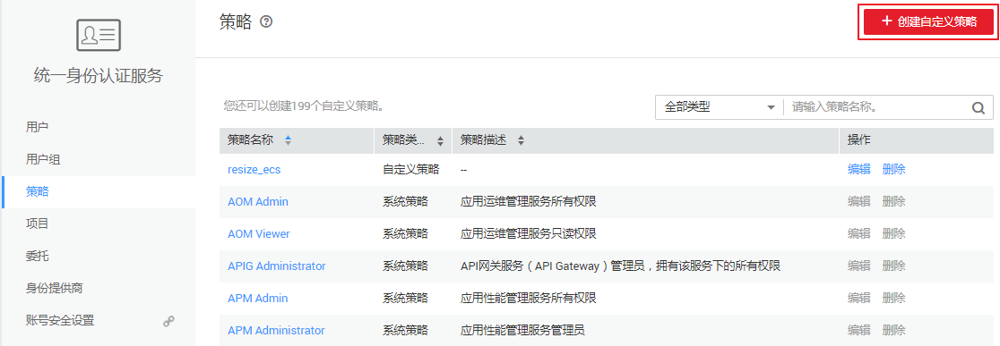
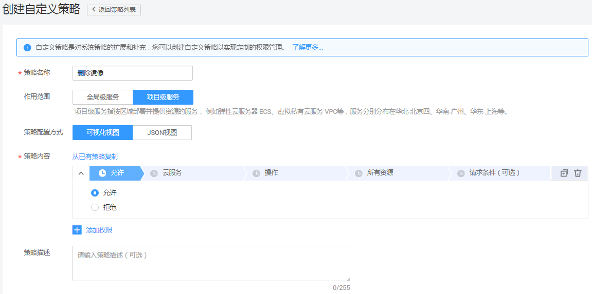
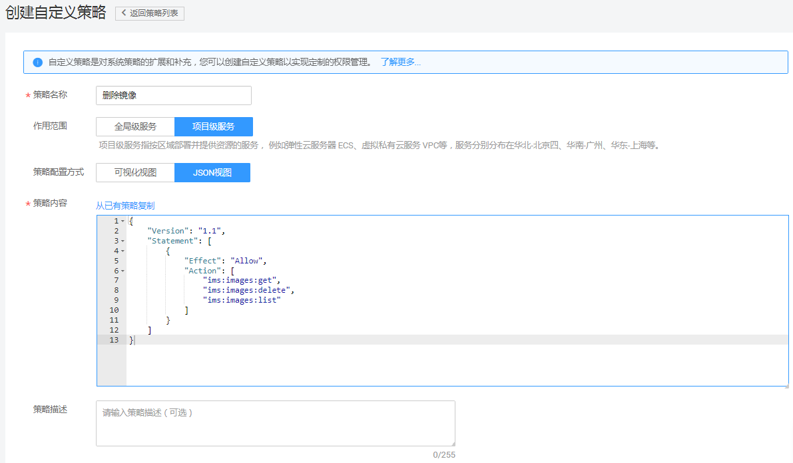

# 创建IMS自定义策略<a name="ims_01_0415"></a>

如果系统预置的IMS权限，不满足您的授权要求，可以创建自定义策略。自定义策略中可以添加的授权项（Action）请参考：[策略及授权项说明](https://support.huaweicloud.com/api-ims/zh-cn_topic_0171654733.html)。

目前华为云支持以下两种方式创建自定义策略：

-   可视化视图创建自定义策略：无需了解策略语法，按可视化视图导航栏选择云服务、操作、资源、条件等策略内容，可自动生成策略。
-   JSON视图创建自定义策略：可以在选择策略模板后，根据具体需求编辑策略内容；也可以直接在编辑框内编写JSON格式的策略内容。

如下以定制一个用户仅能删除镜像的策略为例，分别采用可视化视图和JSON视图的配置方式创建自定义策略。

## 前提条件<a name="section7446158394"></a>

-   请先在IAM控制台中开通细粒度策略，开通方法请参见：[申请细粒度访问控制公测](https://support.huaweicloud.com/usermanual-iam/iam_01_019.html)。
-   如需使用JSON视图创建自定义策略，请您先熟悉策略结构，具体请参见[策略语法：细粒度策略](策略语法-细粒度策略.md)。
-   请确定自定义策略需要允许哪些操作，拒绝哪些操作，并获取操作对应的授权项。授权项请参见：[策略及授权项说明](https://support.huaweicloud.com/api-ims/zh-cn_topic_0171654733.html)。

## 可视化视图配置自定义策略<a name="section2095751713323"></a>

1.  在IAM控制台，选择左侧导航栏的“策略”，在右上角单击“创建自定义策略”。

    **图 1**  创建自定义策略<a name="fig1611924143510"></a>  
    

2.  在“创建自定义策略”中，配置如下信息：

    **图 2**  策略基本信息<a name="fig3364132719550"></a>  
    

    -   “策略名称”：填写“删除镜像”。
    -   “作用范围”：根据服务的属性填写，IMS为项目级服务，选择“项目级服务”。
    -   “策略配置方式”：选择“可视化视图”。
    -   “策略内容”：
        1.  选择“允许”。
        2.  在“云服务”中搜索“IMS”，选择“镜像服务 \(IMS\)”。
        3.  在“操作”中勾选“ReadWrite”中的“ims:images:delete”，即“删除镜像”。“ims:images:delete”依赖“ims:images:list”（查询镜像列表）和“ims:images:get”（查询镜像详情）两个操作，因此，还需要勾选“ListOnly”中的“ims:images:list”和“ReadOnly”中的“ims:images:get”。
        4.  单击“确定”，自定义策略创建完成。

            系统返回策略列表，可以看到创建成功的自定义策略“删除镜像”。


## JSON视图配置自定义策略<a name="section10463781193"></a>

1.  在IAM控制台，选择左侧导航栏的“策略”，在右上角单击“创建自定义策略”。

    **图 3**  创建自定义策略<a name="fig74101347142410"></a>  
    

2.  在“创建自定义策略”中，填写如下参数：

    **图 4**  策略基本信息<a name="fig8684143018353"></a>  
    

    -   “策略名称”：填写“删除镜像”。
    -   “作用范围”：根据服务的属性填写，IMS为项目级服务，选择“项目级服务”。
    -   “策略配置方式”：选择“JSON视图”。
    -   “策略内容”：将如下内容拷贝至策略内容中。如下策略表示允许删除镜像。

        ```
        {
              "Version": "1.1",
              "Statement": [
                    {
                          "Effect": "Allow",
                          "Action": [
                                "ims:images:get",
                                "ims:images:delete",
                                "ims:images:list"
                          ]
                    }
              ]
        }
        ```

3.  单击“确定”后，系统会自动校验语法，如跳转到策略列表，则自定义策略创建成功；如提示“策略内容错误”，请按照语法规范进行修改。

## 验证自定义策略权限<a name="section12446820122011"></a>

1.  将新创建的自定义策略授予用户组，使得用户组中的用户仅具备删除镜像的权限。
2.  用户登录并验证自定义策略定义的权限：删除镜像。

    权限授予成功后，用户可以通过控制台以及REST API等多种方式验证。此处以登录控制台为例，介绍用户如何验证删除镜像的权限。

    1.  使用新创建的用户登录华为云，登录方法选择为“IAM用户登录”。
        -   账号名为该IAM用户所属华为云账号的名称。
        -   用户名和密码为账号在IAM创建用户时输入的用户名和密码。

    2.  在镜像服务页面，进行删除镜像操作，操作成功，权限配置正确并已生效。
    3.  尝试进行其他操作，例如：导出镜像

        系统显示“权限不足”，权限配置正确并已生效。


## 策略样例<a name="section1449217811913"></a>

-   示例1：授权用户制作镜像

    ```
    {
        "Version": "1.1",
        "Statement": [
            {
                "Effect": "Allow",
                "Action": [
                    "ims:serverImages:create",
                    "obs:bucket:*",
                    "obs:object:*",
                    "kms:*:*",
                    "ecs:cloudServers:get",
                    "ecs:servers:get",
                    "ecs:serverVolumes:use",
                    "ecs:cloudServers:list",
                    "ecs:serverVolumeAttachments:list",
                    "ecs:servers:list",
                    "evs:volumes:*",
                    "bms:servers:list",
                    "bms:servers:get",
                    "bms:serverFlavors:get"
                ]
            }
        ]
    }
    ```

    > **说明：**   
    >制作镜像对应的授权项为：ims:serverImages:create，其他授权项均为制作镜像所依赖的授权项。  

-   示例2：拒绝用户删除镜像

    拒绝策略需要同时配合其他策略使用，否则没有实际作用。用户被授予的策略中，一个授权项的作用如果同时存在Allow和Deny，则遵循Deny优先。

    如果您给用户授予IMS Admin的系统策略，但不希望用户拥有IMS Admin中定义的删除镜像权限，您可以创建一条拒绝删除镜像的自定义策略，然后同时将IMS Admin和拒绝策略授予用户，根据Deny优先原则，则用户可以对IMS执行除了删除镜像外的所有操作。拒绝策略示例如下：

    ```
    {
        "Version": "1.1",
        "Statement": [
            {
              "Effect": "Deny"
              "Action": [
                    "ims:images:delete"
                ],
              }
        ]
    }
    ```


