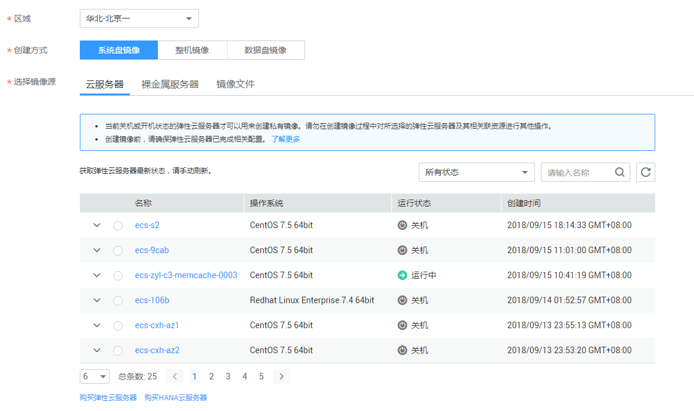

# 创建Windows私有镜像

本节介绍如何通过云服务器创建Windows私有镜像。

## 前提条件

-   已确保Windows云服务器网卡设置为DHCP的方式动态获取网络地址，具体方法请参见[配置Windows云服务器](配置Windows云服务器.md)。
-   已安装Cloudbase-init工具。

## 操作步骤

1.  登录管理控制台。
2.  选择“计算 \> 镜像服务”。
3.  在“镜像服务”列表页面，单击“创建私有镜像”。
4.  在“镜像类型和来源”页面，选择镜像的创建方式为“系统盘镜像”。
5.  镜像的源默认选择为“云服务器”，从列表中选择相应的云服务器。如[图1](#fig1167418168252)所示。

    **图 1**  创建系统盘镜像  
    

6.  在镜像配置信息页面，填写镜像的基本信息，例如，镜像名称和描述信息。
7.  单击“立即申请”。
8.  根据界面提示，确认镜像参数。阅读并勾选《镜像制作承诺书》和《华为镜像免责声明》，单击“提交申请”。
9.  根据界面提示，返回私有镜像列表查看镜像状态。

    镜像创建时间与镜像文件本身大小有关，大约需要20分钟，当镜像的状态为“正常”时，表示创建完成。

    > **说明：**   
    >-   在创建镜像过程中，请勿对所选择的云服务器及其相关联资源进行其他操作。  
    >-   使用加密镜像创建的弹性云服务器为加密的弹性云服务器，加密的云服务器的密钥与加密镜像的密钥相同。  
    >-   使用加密的弹性云服务器创建的镜像为加密镜像，该加密镜像的密钥与加密的云服务器的密钥相同。  

