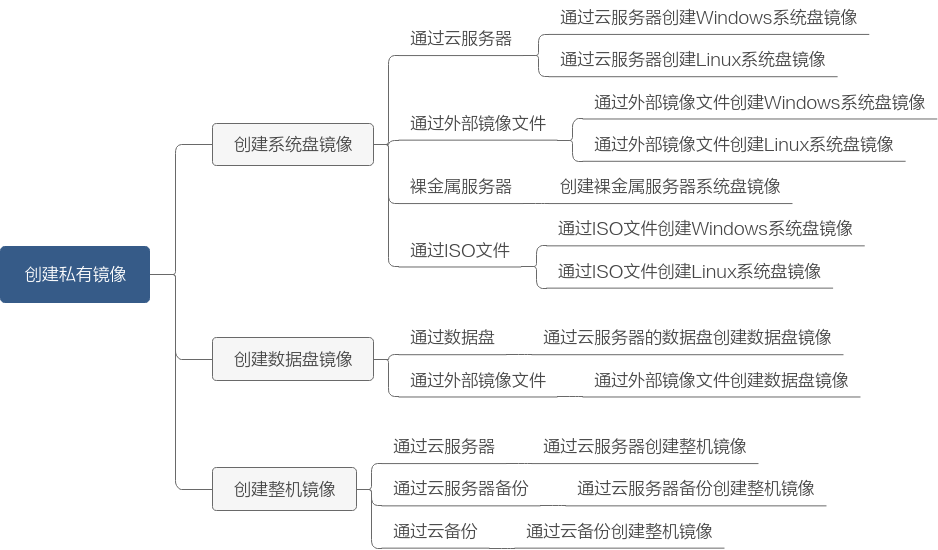

# 创建方式导航

私有镜像是包含操作系统、预装的公共应用以及用户私有应用的镜像，仅用户个人可见。私有镜像包括系统盘镜像、数据盘镜像和整机镜像，由现有运行的云服务器创建而来，或由外部导入而来。

本章介绍以下创建私有镜像的方法：

-   [通过云服务器创建Windows系统盘镜像](通过云服务器创建Windows系统盘镜像.md)
-   [通过云服务器创建Linux系统盘镜像](通过云服务器创建Linux系统盘镜像.md)
-   [通过外部镜像文件创建Windows系统盘镜像](通过外部镜像文件创建Windows系统盘镜像.md)
-   [通过外部镜像文件创建Linux系统盘镜像](通过外部镜像文件创建Linux系统盘镜像.md)
-   [创建裸金属服务器系统盘镜像](创建裸金属服务器系统盘镜像.md)
-   [通过数据盘创建数据盘镜像](通过数据盘创建数据盘镜像.md)
-   [通过外部镜像文件创建数据盘镜像](通过外部镜像文件创建数据盘镜像.md)
-   [通过云服务器创建整机镜像](通过云服务器创建整机镜像.md)
-   [通过云服务器备份创建整机镜像](通过云服务器备份创建整机镜像.md)
-   [通过云备份创建整机镜像](通过云备份创建整机镜像.md)
-   [通过ISO文件创建Windows系统盘镜像](通过ISO文件创建Windows系统盘镜像.md)
-   [通过ISO文件创建Linux系统盘镜像](通过ISO文件创建Linux系统盘镜像.md)

**图 1**  创建私有镜像全景图  

## 导入镜像场景说明

华为云提供了多种导入镜像的方式，您可以根据自己的镜像文件类型、格式，或者大小来选择使用何种方式。

-   若镜像文件为数据盘文件，则参考[通过外部镜像文件创建数据盘镜像](通过外部镜像文件创建数据盘镜像.md)进行镜像导入。
-   若镜像文件为系统盘文件，可根据镜像文件格式和大小来判断：

    **表 1**  导入系统盘文件

    
    <table><thead align="left"><tr id="row184580179515"><th class="cellrowborder" valign="top" width="29.187081291870815%" id="mcps1.2.4.1.1">
镜像文件格式

    </th>
    <th class="cellrowborder" valign="top" width="23.21767823217678%" id="mcps1.2.4.1.2">
镜像文件大小

    </th>
    <th class="cellrowborder" valign="top" width="47.59524047595241%" id="mcps1.2.4.1.3">
参考指导

    </th>
    </tr>
    </thead>
    <tbody><tr id="row17458717454"><td class="cellrowborder" valign="top" width="29.187081291870815%" headers="mcps1.2.4.1.1 ">
vmdk、vhd、qcow2、vhdx、qed、vdi、qcow和zvhd

    </td>
    <td class="cellrowborder" valign="top" width="23.21767823217678%" headers="mcps1.2.4.1.2 ">
不超过128GB

    </td>
    <td class="cellrowborder" valign="top" width="47.59524047595241%" headers="mcps1.2.4.1.3 "><ul id="ul13328767352"><li><a href="流程概览（Windows）.md">通过外部镜像文件创建Windows系统盘镜像</a></li><li><a href="流程概览（Linux）.md">通过外部镜像文件创建Linux系统盘镜像</a></li></ul>
    </td>
    </tr>
    <tr id="row845821716515"><td class="cellrowborder" valign="top" width="29.187081291870815%" headers="mcps1.2.4.1.1 ">
raw、zvhd2

    </td>
    <td class="cellrowborder" valign="top" width="23.21767823217678%" headers="mcps1.2.4.1.2 ">
不超过1TB

    </td>
    <td class="cellrowborder" valign="top" width="47.59524047595241%" headers="mcps1.2.4.1.3 "><ul id="ul122821520265"><li><a href="流程概览.md">快速导入镜像文件</a></li></ul>
    </td>
    </tr>
    <tr id="row83041547132518"><td class="cellrowborder" valign="top" width="29.187081291870815%" headers="mcps1.2.4.1.1 ">
iso

    </td>
    <td class="cellrowborder" valign="top" width="23.21767823217678%" headers="mcps1.2.4.1.2 ">
不超过128GB

    </td>
    <td class="cellrowborder" valign="top" width="47.59524047595241%" headers="mcps1.2.4.1.3 "><ul id="ul7455115801615"><li><a href="创建流程（Windows）.md">通过ISO文件创建Windows系统盘镜像</a></li><li><a href="创建流程（Linux）.md">通过ISO文件创建Linux系统盘镜像</a></li></ul>
    </td>
    </tr>
    </tbody>
    </table>

