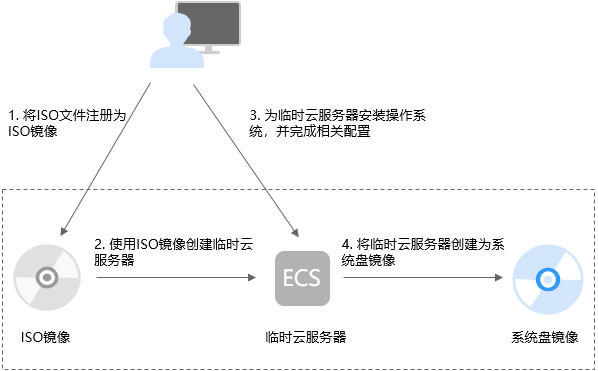

# 创建流程（Linux）

ISO是一种光盘映像文件，通过特定的压缩方式，将大量的数据文件统一为一个后缀名为iso的映像文件。ISO文件可以理解为从光盘中复制出来的数据文件，所以ISO文件无法直接使用，需要利用一些工具进行解压后才能使用。例如使用虚拟光驱打开，或者将ISO文件刻录到光盘中后，使用光驱来进行读取。

本章介绍通过ISO文件创建Linux系统盘镜像的操作过程。

## 创建过程

通过ISO文件创建Linux系统盘镜像的流程如[图1](#fig274601384111)所示。

**图 1**  创建过程（Linux系统盘镜像）  

步骤说明如下：

1.  **将ISO文件注册为ISO镜像**

    在管理控制台上将准备好的ISO文件注册为镜像。该镜像为ISO镜像，不能直接用于发放云服务器。详情请参考[将ISO文件注册为镜像（Linux）](将ISO文件注册为镜像（Linux）.md)。

2.  **使用ISO镜像创建临时云服务器**

    使用注册成功的ISO镜像创建一个临时云服务器，该云服务器为空云服务器，即没有操作系统，也未安装任何驱动。详情请参考[使用ISO镜像创建Linux云服务器](使用ISO镜像创建Linux云服务器.md)。

3.  **为临时云服务器安装操作系统和驱动，并完成相关配置**

    包含如下操作：安装操作系统、安装原生的XEN和KVM驱动、配置网卡属性、清理网络规则文件等。详情请参考[安装Linux操作系统](安装Linux操作系统.md)和[配置云服务器并创建Linux系统盘镜像](配置云服务器并创建Linux系统盘镜像.md)中的步骤[1](配置云服务器并创建Linux系统盘镜像.md#li171711192182)。

4.  **将临时云服务器创建为系统盘镜像**

    在管理控制台上将已完成安装和配置的临时云服务器创建为系统盘镜像。镜像创建成功后，删除临时云服务器避免继续产生费用。详情请参考[配置云服务器并创建Linux系统盘镜像](配置云服务器并创建Linux系统盘镜像.md)中的步骤[2](配置云服务器并创建Linux系统盘镜像.md#li20752183012118)。

## 约束与限制

使用ISO文件创建的私有镜像不支持复制、导出和加密。

