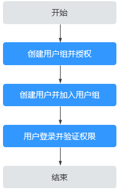

# 创建用户并授权使用IMS

如果您需要对您所拥有的IMS资源进行精细的权限管理，可以使用[统一身份认证服务](https://support.huaweicloud.com/usermanual-iam/iam_01_0001.html)（Identity and Access Management，简称IAM）。通过IAM，您可以：

-   根据企业的业务组织，在您的华为云账号中，给企业中不同职能部门的员工创建IAM用户，让员工拥有唯一安全凭证，并使用IMS资源。
-   根据企业用户的职能，设置不同的访问权限，以达到用户之间的权限隔离。
-   将IMS资源委托给更专业、高效的其他华为云账号或者云服务，这些账号或者云服务可以根据权限进行代运维。

如果华为云账号已经能满足您的要求，不需要创建独立的IAM用户，您可以跳过本章节，不影响您使用IMS的其他功能。

本章节以授予“IMS ReadOnlyAccess”权限为例介绍为用户授权的方法，操作流程如[图1](#fig5293113815405)所示。

## 前提条件

给用户组授权之前，请您了解用户组可以添加的IMS权限，并结合实际需求进行选择，IMS支持的系统权限，请参见：[IMS系统权限](https://support.huaweicloud.com/productdesc-ims/ims_01_0009.html#section0)。若您需要对除IMS之外的其他服务授权，IAM支持服务的所有权限请参见：[系统权限](https://support.huaweicloud.com/usermanual-permissions/iam_01_0001.html)。

## 示例流程

**图 1**  给用户授予IMS权限流程  

1.  [创建用户组并授权](https://support.huaweicloud.com/usermanual-iam/iam_03_0001.html)

    在IAM控制台创建用户组，并授予镜像服务只读权限“IMS ReadOnlyAccess”。

2.  [创建用户并加入用户组](https://support.huaweicloud.com/usermanual-iam/iam_02_0001.html)

    在IAM控制台创建用户，并将其加入[1](#li2021991142518)中创建的用户组。

3.  [用户登录](https://support.huaweicloud.com/usermanual-iam/iam_01_0552.html)并验证权限

    新创建的用户登录控制台，切换至授权区域，验证权限（假设当前权限仅包含IMS ReadOnlyAccess）。

    -   在“服务列表”中选择镜像服务，进入IMS主界面，执行除查询以外的其他操作，如：创建、修改、删除等。

        示例：单击右上角“创建私有镜像”，若提示权限不足，表示“IMS ReadOnlyAccess”已生效。

    -   在“服务列表”中选择除镜像服务外的任意一个服务，如“虚拟私有云”，若提示权限不足，表示“IMS ReadOnlyAccess”已生效。

