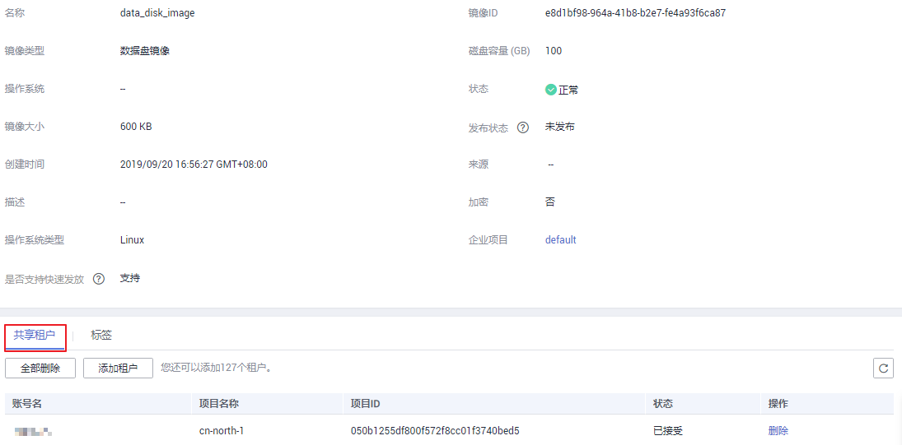

# 删除镜像的共享租户

## 操作场景

用户可以编辑已共享的私有镜像成员列表，删除共享镜像的租户。

## 前提条件

-   用户有已共享的私有镜像。
-   用户已获取要删除的共享租户的账号名。

## 操作步骤

1.  登录管理控制台。
2.  选择“计算 \> 镜像服务”。
3.  单击“私有镜像”页签进入镜像列表页面。
4.  单击镜像名称，进入镜像详情页面。
5.  查看共享租户。

    **图 1**  查看镜像详情  
    

6.  在租户列表中，选择删除成员的方式。
    -   删除单个成员：单击需要删除成员所在行的“删除”。
    -   删除全部成员：单击租户列表上方的“全部删除”。

7.  单击“是”。

