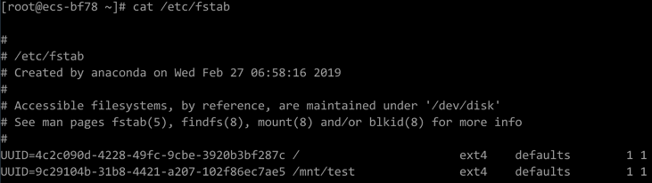

# 卸载云服务器的数据盘<a name="ims_01_0410"></a>

如果创建私有镜像所使用的原云服务器挂载了多个数据盘，可能导致由私有镜像创建的新云服务器无法使用。因此在创建私有镜像前，需要卸载原云服务器中挂载的所有数据盘。

本节介绍如何卸载云服务器中挂载的所有数据盘。

## 前提条件<a name="zh-cn_topic_0029124569_section35785020162659"></a>

已登录到创建Linux私有镜像所使用的云服务器。

## 操作步骤<a name="zh-cn_topic_0029124569_section2028415785743"></a>

1.  查询是否挂载数据盘。

    执行以下命令，检查云服务器挂载的磁盘块数。

    **fdisk -l**

    -   磁盘块数＞1，表示云服务器挂载有数据盘，执行[2](#li113301841113110)。
    -   磁盘块数=1，表示云服务器未挂载数据盘，执行[3](#li9263195973116)。

2.  <a name="li113301841113110"></a>执行以下命令，检查当前云服务器挂载的数据分区。

    **mount**

    -   回显不包含数据盘分区的信息时，无需进行卸载数据盘的操作。

        ```
        /dev/vda1 on / type ext4 (rw,relatime,data=ordered)
        ```

    -   回显包含类似如下信息，请执行[3](#li9263195973116)。

        ```
        /dev/vda1 on / type ext4 (rw,relatime,data=ordered)
        /dev/vdb1 on /mnt/test type ext4 (rw,relatime,data=ordered)
        ```

3.  <a name="li9263195973116"></a>清理“fstab”文件中的配置信息。
    1.  执行以下命令编辑“fstab”文件。

        **vi /etc/fstab**

    2.  删除相关数据盘在“fstab”文件中的配置信息。

        “/etc/fstab”文件中记录了系统启动时自动挂载的文件系统和存储设备的信息，需要删除，如[图1](#zh-cn_topic_0029124569_fig2831914985830)中最后一行是数据盘在“fstab”中的配置信息。

        **图 1**  数据盘在fstab文件中的配置信息<a name="zh-cn_topic_0029124569_fig2831914985830"></a>  
        

4.  执行如下命令，卸载已挂载的数据盘。

    卸载前请确认数据盘上没有任何数据读写，否则会导致卸载失败。

    **umount** _/dev/vdb__1_

5.  执行以下命令，再次查看当前云服务器挂载的数据分区。

    **mount**

    回显信息中不再包含数据盘分区的信息时，则表示卸载成功。


