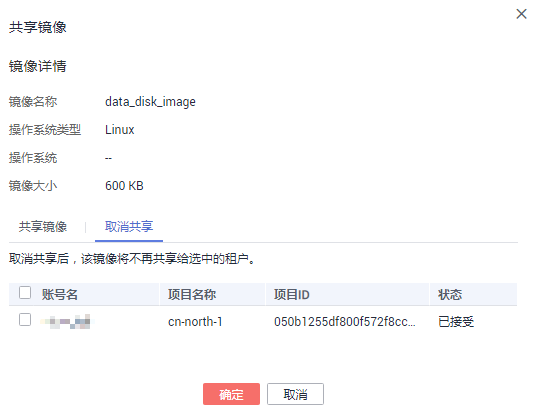

# 取消共享镜像

## 操作场景

用户可以取消共享给其他用户的镜像。

## 前提条件

用户已共享私有镜像给其他用户。

## 操作步骤

1.  登录管理控制台。
2.  选择“计算 \> 镜像服务”。
3.  单击“私有镜像”页签进入镜像列表页面。
4.  在需要取消共享的私有镜像所在行的操作列中，单击“更多”，选择“共享”。
5.  在共享镜像的对话框中单击“取消共享”页签。

    **图 1**  取消共享镜像  
    

6.  勾选需要取消共享的账号名，单击“确定”。

