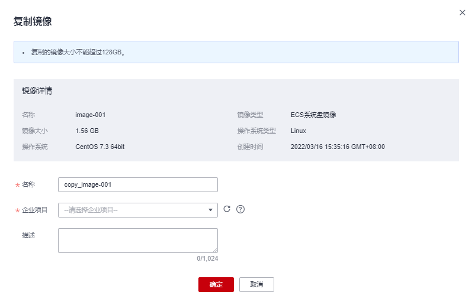

# 复制共享镜像

## 操作场景

您可以通过复制共享镜像功能，将共享镜像创建为私有镜像。复制后的镜像将显示在私有镜像列表中，和其他私有镜像一样，支持创建云服务器、导出、共享、复制等功能。

## 约束与限制

-   接受状态的共享镜像才支持复制。

    如需复制拒绝状态的共享镜像，请先接受已拒绝的共享镜像。详情请参见[接受已经拒绝的共享镜像](接受已经拒绝的共享镜像.md)。

-   当前仅支持数据盘镜像和系统盘镜像复制。
-   当前仅支持区域内复制。
-   复制的镜像大小不超过128GB。
-   暂不支持复制为加密镜像。

## 操作步骤

1.  登录管理控制台。
2.  选择“计算 \> 镜像服务”。
3.  在“镜像服务”列表页面，选择“共享镜像”页签。

    系统显示已被接受的共享镜像。

4.  选中待复制的共享镜像，单击“操作”列下的“更多 \> 复制”。

    **图 1**  复制镜像  
    

5.  在“复制镜像”对话框中，输入新镜像的“名称”，选择“企业项目”，并输入镜像的描述信息。
6.  单击“确定”。

    您可以选择“私有镜像”页签，在私有镜像列表栏，查看复制后镜像的创建状态。当镜像的状态为“正常”时，表示创建完成。

