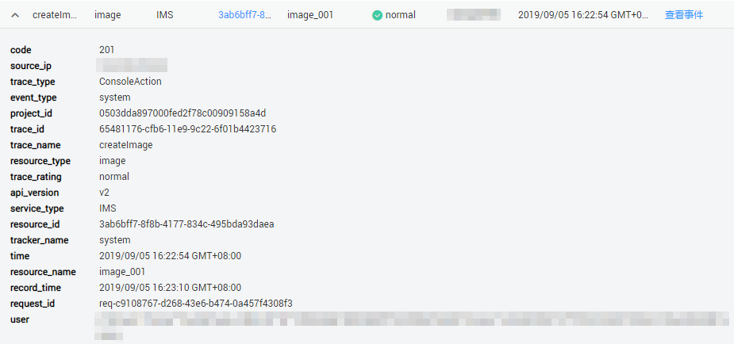

# 如何查看审计日志

## 操作场景

开启了云审计服务后，系统开始记录镜像服务相关的操作。云审计服务管理控制台保存最近7天的操作记录。

## 操作步骤

1.  登录管理控制台。
2.  单击“服务列表”，选择“管理与部署 \> 云审计服务”，进入云审计服务信息页面。
3.  单击左侧导航树的“事件列表”，进入事件列表信息页面。
4.  事件记录了云资源的操作详情，单击“Region”页签，设置筛选条件，单击“查询”。

    当前事件列表支持四个维度的组合查询，详细信息如下：

    -   事件类型、事件来源、资源类型和筛选类型。
        -   在下拉框中选择查询条件。其中，“事件类型”选择“管理事件”，“事件来源”选择“IMS”。
        -   其中筛选类型选择资源ID时，还需手动输入某个具体的资源ID，目前仅支持全字匹配模式的查询。
        -   选择资源名称时，还需选择或手动输入某个具体的资源名称。

    -   操作用户：在下拉框中选择某一具体的操作用户，此操作用户指用户级别，而非租户级别。
    -   事件级别：可选项为“所有事件级别”、“normal”、“warning”、“incident”，只可选择其中一项。
    -   时间范围：可选项为“最近1小时”、“最近1天”、“最近1周”和“自定义时间段”。

5.  在需要查看的记录左侧，展开该记录的详细信息。

    **图 1**  展开记录  
    

6.  在需要查看的记录右侧，单击“查看事件”，弹出一个窗口，显示了该操作事件结构的详细信息。

