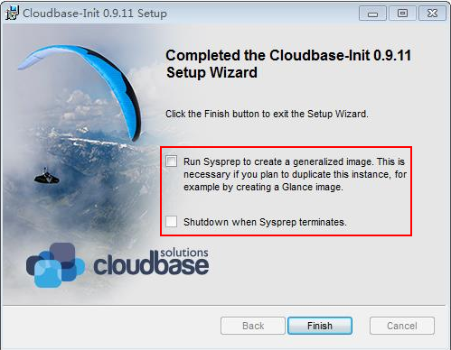

# 安装Cloudbase-Init工具<a name="ZH-CN_TOPIC_0030730602"></a>

为了保证使用私有镜像创建的新云服务器可以自定义配置（例如修改云服务器密码），建议您在创建私有镜像前安装Cloudbase-init工具。

## 操作场景<a name="zh-cn_topic_0029124575_section21661076191949"></a>

-   不安装Cloudbase-init工具，将无法对云服务器进行自定义配置，只能使用镜像原有密码登录云服务器。
-   使用公共镜像创建的云服务器，默认已经安装Cloudbase-init，不需要执行安装及配置操作。
-   用户导入镜文件创建的云服务器，请按照指导安装及配置Cloudbase-init。

## 前提条件<a name="zh-cn_topic_0029124575_section31429961161037"></a>

-   已为Windows云服务器绑定弹性IP。
-   已登录到Windows云服务器。
-   Windows云服务器的网卡属性为DHCP方式。
-   已安装一键式密码重置插件。因为安装Cloudbase-init工具的操作步骤中如果有重启云服务器的操作，可能导致密码被修改为一个随机密码。所以需要安装一键式密码重置插件重置密码。

## 安装Cloudbase-init工具<a name="zh-cn_topic_0029124575_section54473519191017"></a>

1.  安装Cloudbase-init工具前请确保已安装一键式密码重置插件。操作步骤请参考[安装一键式密码重置插件\(Windows\)](安装一键式密码重置插件(Windows).md)。
2.  在Windows操作系统中，单击“开始”，选择“控制面板 \> 程序 \> 程序和功能”查看是否安装Cloudbase-init。
    -   是，执行[配置Cloudbase-init工具](#section67455211370)
    -   否，执行以下安装操作步骤。

3.  操作系统是否为Window桌面版。
    -   是，执行[4](#li5127112791712)。
    -   否，若操作系统为Windows Server版本，请执行[5](#zh-cn_topic_0029124575_li6098361192920)。

4.  <a name="li5127112791712"></a>如果操作系统是Windows桌面版，如Window 7或者Windows 10，那么需要在安装Cloudbase-init前确保Adminstrator帐号未禁用。以Windows 7为例，具体操作请以实际为准。
    1.  在操作系统中单击“开始”，选择的“控制面板 \> 系统和安全 \> 管理工具”。
    2.  双击“计算机管理”。
    3.  选择“系统工具 \> 本地用户和组 \> 用户”。
    4.  右键单击“Administrator”，选择“属性”。
    5.  确认已取消勾选“帐户已禁用”选项。

5.  <a name="zh-cn_topic_0029124575_li6098361192920"></a>下载Cloudbase-init工具安装包。

    根据Windows操作系统的不同位数，您需要下载不同版本的Cloudbase-init工具安装包。Cloudbase官网：[http://www.cloudbase.it/cloud-init-for-windows-instances/](http://www.cloudbase.it/cloud-init-for-windows-instances/)。

    Cloudbase-init分为稳定版本和Beta版本两种。

    稳定版本获取路径:

    -   64位：[https://www.cloudbase.it/downloads/CloudbaseInitSetup\_Stable\_x64.msi](https://www.cloudbase.it/downloads/CloudbaseInitSetup_Stable_x64.msi)
    -   32位：[https://www.cloudbase.it/downloads/CloudbaseInitSetup\_Stable\_x86.msi](https://www.cloudbase.it/downloads/CloudbaseInitSetup_Stable_x86.msi)

    Beta版本获取路径：

    -   64位：[https://www.cloudbase.it/downloads/CloudbaseInitSetup\_x64.msi](https://www.cloudbase.it/downloads/CloudbaseInitSetup_x64.msi)
    -   32位：[https://www.cloudbase.it/downloads/CloudbaseInitSetup\_x86.msi](https://www.cloudbase.it/downloads/CloudbaseInitSetup_x86.msi)

6.  双击打开Cloudbase-init工具安装包开始安装。
7.  单击“Next”。
8.  勾选“I accept the terms in the License Agreement”，单击“Next”。
9.  使用Cloudbase-init默认安装路径进行安装，单击“Next”。
10. 在“Configuration options”窗口中，设置用户名为“Administrator”，日志输出串口选择“COM1”，且不勾选“Run Cloudbase-Init service as LocalSystem”。如[图1](#fig416499174516)所示。

    > **说明：**   
    >图片中版本编号仅供参考，请以最新版本为准。  

    **图 1**  设置参数<a name="fig416499174516"></a>  
    

11. 单击“Next”。
12. 单击“Install”。
13. 在“Files in Use”窗口保留默认勾选“Close the application and attempt to restart them”，单击“OK”。
14. 操作系统是否为Window桌面版。
    -   是，执行[16](#li8450150161333)。
    -   否，执行[15](#li208441311639)。

15. <a name="li208441311639"></a>在“Completed the Cloudbase-Init Setup Wizard ”窗口，请勿勾选“Run Sysprep to create a generalized Image. This is necessary if you plan to duplicate this instance, for example by creating a Glance image”及“Shutdown when Sysprep terminate”。如[图2](#fig515010583213)所示。

    **图 2**  完成安装<a name="fig515010583213"></a>  
    

    > **说明：**   
    >图片中版本编号仅供参考，请以最新版本为准。  

16. <a name="li8450150161333"></a>单击“Finish”。

## 配置Cloudbase-init工具<a name="section67455211370"></a>

1.  在cloudbase-init安装路径的配置文件“C:\\Program Files\\Cloudbase Solutions\\Cloudbase-Init\\conf\\cloudbase-init.conf”的最后一行，增加配置项“netbios\_host\_name\_compatibility=false”，使Windows系统的hostname长度支持到63个字符。

    > **说明：**   
    >NetBIOS长度受Windows系统本身的限制还只支持小于等于15个字符。  

2.  在cloudbase-init安装路径的配置文件“C:\\Program Files\\Cloudbase Solutions\\Cloudbase-Init\\conf\\cloudbase-init.conf”中增加配置项“metadata\_services=cloudbaseinit.metadata.services.httpservice.HttpService”，配置agent访问openstack数据源。
3.  在cloudbase-init安装路径的配置文件“C:\\Program Files\\Cloudbase Solutions\\Cloudbase-Init\\conf\\cloudbase-init.conf”中增加如下配置项，配置获取metadata的重试次数和间隔。

    ```
    retry_count=40
    retry_count_interval=5
    ```

4.  在cloudbase-init安装路径的配置文件“C:\\Program Files\\Cloudbase Solutions\\Cloudbase-Init\\conf\\cloudbase-init.conf”中增加如下配置项，防止Windows添加默认路由导致metadata网络不通。

    ```
    [openstack]
    add_metadata_private_ip_route=False
    ```

5.  **（可选）**当cloudbase-init为0.9.12及以上版本时，用户可以自定义配置密码长度。在cloudbase-init安装路径的配置文件“C:\\Program Files\\Cloudbase Solutions\\Cloudbase-Init\\conf\\cloudbase-init.conf”里修改配置项“user\_password\_length”的值，完成密码长度的自定义配置。
6.  **（可选）**选择密码注入方式首次登录时，系统默认强制用户修改登录密码，若用户根据个人意愿，不需要修改首次登录使用的登录密码时，可关闭此功能。在cloudbase-init安装路径的配置文件“C:\\Program Files\\Cloudbase Solutions\\Cloudbase-Init\\conf\\cloudbase-init.conf”配置里增加配置项“first\_logon\_behaviour=no”。
7.  为了防止镜像中DHCP租期过长导致创建的云服务器无法正确的获取地址，用户需要释放当前的DHCP地址。

    在windows命令行中，执行以下命令释放当前的DHCP地址。

    **ipconfig /release**

    > **说明：**   
    >此操作会中断网络，对云服务器的使用会产生影响。当云服务器再次开机后，网络会自动恢复。  

8.  使用Windows操作系统云服务器制作镜像时，需修改云服务器SAN策略为OnlineAll类型。否则可能导致使用镜像创建云服务器时磁盘处于脱机状态。

    Windows操作系统SAN策略分为三种类型：OnlineAll，OfflineShared，OfflineInternal

    **表 1**  Windows操作系统SAN策略类型

    <a name="table01861238133815"></a>
    <table><thead align="left"><tr id="row81963383381"><th class="cellrowborder" valign="top" width="15%" id="mcps1.2.3.1.1"><p id="p420114385381"><a name="p420114385381"></a><a name="p420114385381"></a>类型</p>
    </th>
    <th class="cellrowborder" valign="top" width="85%" id="mcps1.2.3.1.2"><p id="p9201838153816"><a name="p9201838153816"></a><a name="p9201838153816"></a>说明</p>
    </th>
    </tr>
    </thead>
    <tbody><tr id="row12204113873819"><td class="cellrowborder" valign="top" width="15%" headers="mcps1.2.3.1.1 "><p id="p220511386388"><a name="p220511386388"></a><a name="p220511386388"></a>OnlineAll</p>
    </td>
    <td class="cellrowborder" valign="top" width="85%" headers="mcps1.2.3.1.2 "><p id="p320719385384"><a name="p320719385384"></a><a name="p320719385384"></a>表示所有新发现磁盘都置于在线模式。</p>
    </td>
    </tr>
    <tr id="row1420833823819"><td class="cellrowborder" valign="top" width="15%" headers="mcps1.2.3.1.1 "><p id="p17209183853811"><a name="p17209183853811"></a><a name="p17209183853811"></a>OfflineShared</p>
    </td>
    <td class="cellrowborder" valign="top" width="85%" headers="mcps1.2.3.1.2 "><p id="p1621083893810"><a name="p1621083893810"></a><a name="p1621083893810"></a>表示所有共享总线上（比如FC， ISCSI）的新发现磁盘都置于离线模式，非共享总线上的磁盘都置于在线模式。</p>
    </td>
    </tr>
    <tr id="row1621043819381"><td class="cellrowborder" valign="top" width="15%" headers="mcps1.2.3.1.1 "><p id="p12212238153815"><a name="p12212238153815"></a><a name="p12212238153815"></a>OfflineInternal</p>
    </td>
    <td class="cellrowborder" valign="top" width="85%" headers="mcps1.2.3.1.2 "><p id="p2217138133815"><a name="p2217138133815"></a><a name="p2217138133815"></a>表示所有新发现磁盘都置于离线模式。</p>
    </td>
    </tr>
    </tbody>
    </table>

    1.  运行cmd.exe，执行以下命令，使用DiskPart工具来查询云服务器当前的SAN策略。

        **diskpart**

    2.  执行以下命令查看云服务器当前的SAN策略。

        **san**

        -   如果SAN策略为OnlineAll，请执行**exit**命令退出DiskPart。

        -   否，请执行步骤[8.c](#li1823793883810)。

    3.  <a name="li1823793883810"></a>执行以下命令修改云服务器SAN策略为OnlineAll。

        **san policy=onlineall**


