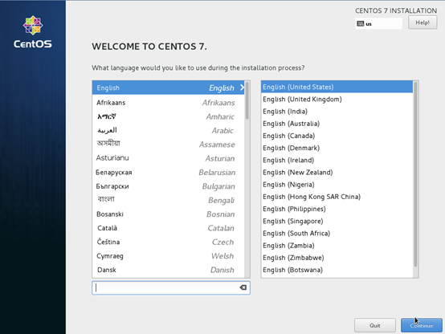
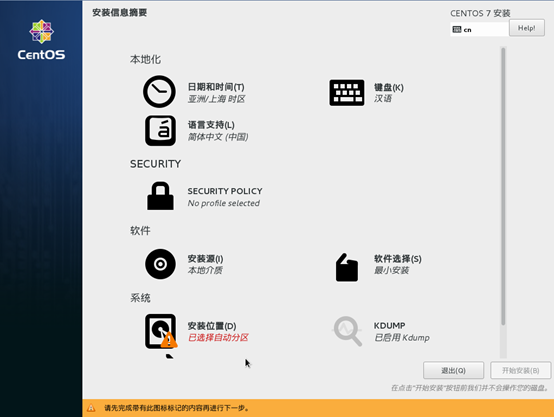
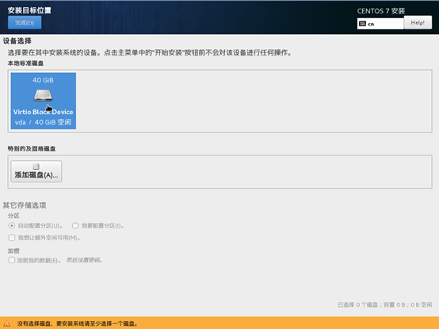
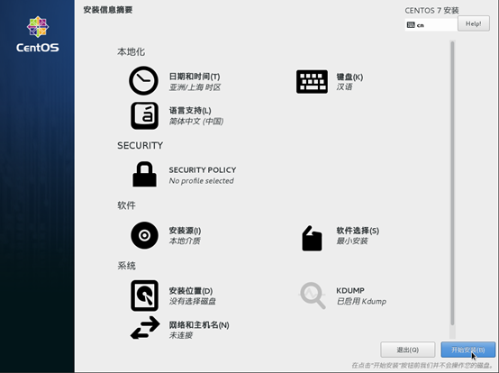
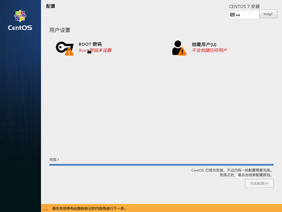
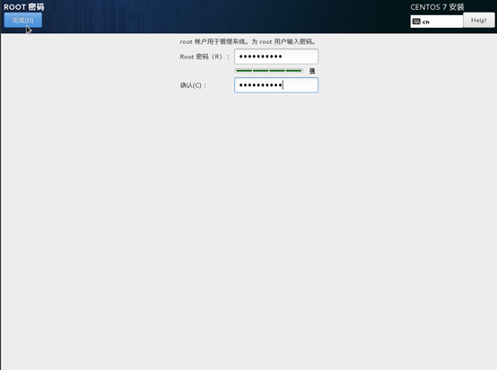
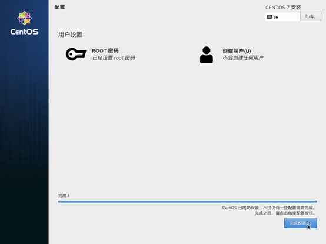
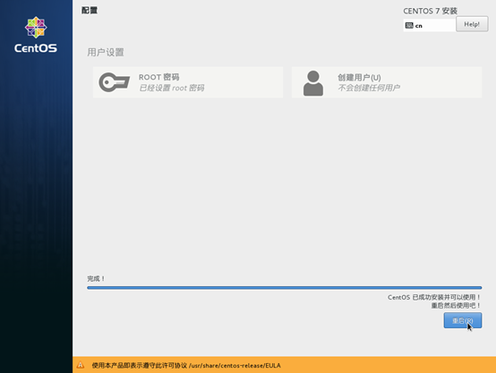

# 安装Linux操作系统

## 操作场景

该任务以“CentOS 7 64位”操作系统为例，指导用户安装Linux操作系统。

由于镜像文件不同，安装步骤稍有不同，请根据实际的安装界面提示进行操作。

> **说明：**   
>请根据实际情况完成时区，KMS地址，补丁服务器和Repo源更新地址，输入法，语言等相关配置。  

## 前提条件

已使用平台提供的“远程登录”方式（即noVNC），登录云服务器并进入安装界面。

## 操作步骤

> **须知：**   
>操作系统安装成功前，禁止关闭或重启弹性云服务器，否则会导致操作系统安装失败。  

1.  在安装界面设置语言项，并单击“Continue”。

    **图 1**  安装界面  
    

2.  在“安装信息摘要”界面，选择“系统 \> 安装位置\(D\)”。

    **图 2**  安装信息摘要  
    

3.  选择待安装系统的磁盘设备，并单击“完成”。

    **图 3**  安装目标位置  
    

4.  单击“开始安装\(B\)”。

    **图 4**  开始安装  
    

5.  等待系统自动安装，待进度条为100%时，CentOS安装完成。

    **图 5**  安装完成  
    

6.  单击“用户设置”栏的“ROOT密码”。

    系统进入“ROOT密码”页面。

7.  根据界面提示，为root用户设置密码，并单击“完成”。

    **图 6**  设置root密码  
    

8.  单击“完成配置”。

    **图 7**  完成配置  
    

9.  单击“重启”。

    重启后，如果系统再次提示您安装操作系统，此时，请退出当前VNC登录界面，并使用控制台提供的“关机”、“开机”按钮，重启弹性云服务器。

    **图 8**  重启  
    

