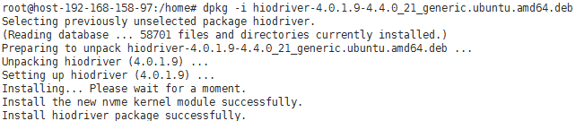

# 安装Linux特殊驱动\(可选\)<a name="ZH-CN_TOPIC_0082002007"></a>

使用私有镜像创建弹性云服务器，需要在制作私有镜像时安装特殊驱动。

1.  P1型云服务器创建完成后，需安装NVIDIA驱动，实现计算加速功能。安装操作，请参见[P1型云服务器安装NVIDIA驱动](http://support.huaweicloud.com/ims_faq/ims_faq_0033.html)。
2.  使用私有镜像创建的H2型云服务器，需在云服务器创建完成后安装InfiniBand网卡驱动。请根据IB类型，在Mellanox官网选择相应版本的InfiniBand网卡驱动下载（建议选择4.2-1.0.0.0的驱动版本下载使用），并根据Mellanox提供的操作指导进行安装。
    -   IB网卡类型：“Mellanox Technologies ConnectX-4 Infiniband HBA \(MCX455A-ECAT\)“
    -   Mellanox官网地址：[http://www.mellanox.com/](http://www.mellanox.com/)
    -   网卡驱动下载地址：[http://www.mellanox.com/page/products\_dyn?product\_family=26&mtag=linux\_sw\_drivers](http://www.mellanox.com/page/products_dyn?product_family=26&mtag=linux_sw_drivers)

3.  使用镜像创建I3型EulerOS\\CentOS云服务器，需要安装NVMe驱动。
    1.  [下载NVMe驱动](http://download.huawei.com/edownload/enterprise/download!download.action?contentType=SOFT&contentId=SW1000268178&partNo=2001&nodePath=fixnode01|7919749|9856522|9856629|21462722|21500649|21501576|21502090|22040035|22706886&idPath=fixnode01|7919749|9856522|9856629|21462722|21500649|21501576|21502090|22040035|22706886&TS=0E-3C-B1-06-EF-03-E4-4E-23-99-30-BB-E9-78-02-4C-A1-F0-0A-E0-32-D7-EA-7A-26-61-A1-09-81-28-78-24-E1-88-CB-87-CA-CC-8B-91-D9-B1-E6-F6-28-5E-2A-62)，解压下载文件，选择\\linux\\driver\\euleros2.2rc2\\ kmod-hiodriver-4.0.1.9-3.10.0\_327.44.58.35.euleros.x86\_64.rpm文件，上传到云服务器的“/home”目录下。
    2.  执行如下命令安装驱动。

        **rpm -ivh kmod-hiodriver-4.0.1.9-3.10.0\_327.44.58.35.euleros.x86\_64.rpm**

        安装过程中屏幕回显如下。

        ```
        Preparing...                          ################################# [100%]
        Updating / installing...
           1:kmod-hiodriver-4.0.1.9-3.10.0_327################################# [100%]
        Installing... Please wait for a moment.
        Install the new nvme kernel module successfully.
        Modify kdump image.Please wait for a moment...50%
        ```

        > **说明：**   
        >-   为了使用镜像创建的I3型云服务器可以支持存储IO多对列，需在制作镜像时根据操作系统不同配置grub文件。具体操作请参考[如何支持存储IO多队列？](http://support.huaweicloud.com/ims_faq/ims_faq_0032.html)  
        >-   I3型云服务器的其它操作系统请在下载的安装包中寻找对应驱动，如果没有则使用系统自带驱动。  


4.  使用镜像创建I3型Ubuntu云服务器时，需要安装ES3000系列的nvme驱动。
    1.  [下载驱动](http://download.huawei.com/edownload/enterprise/download!download.action?contentType=SOFT&contentId=SW1000268178&partNo=2001&nodePath=fixnode01|7919749|9856522|9856629|21462722|21500649|21501576|21502090|22040035|22706886&idPath=fixnode01|7919749|9856522|9856629|21462722|21500649|21501576|21502090|22040035|22706886&TS=0E-3C-B1-06-EF-03-E4-4E-23-99-30-BB-E9-78-02-4C-A1-F0-0A-E0-32-D7-EA-7A-26-61-A1-09-81-28-78-24-E1-88-CB-87-CA-CC-8B-91-D9-B1-E6-F6-28-5E-2A-62)，解压下载文件，将nvme驱动安装包“hiodriver-4.0.1.9-4.4.0\_21\_generic.ubuntu.amd64.deb”上传到云服务器的“/tmp”目录下。
    2.  执行以下命令安装驱动。

        **dpkg -i /tmp/hiodriver-4.0.1.9-4.4.0\_21\_generic.ubuntu.amd64.deb**

        安装过程中屏幕回显如下。

        **图 1**  安装nvme驱动<a name="zh-cn_topic_0029124465_fig29429713194459"></a>  
        

        > **说明：**   
        >-   为了使用镜像创建的I3型云服务器可以支持存储IO多对列，需在制作镜像时根据操作系统不同配置grub文件。具体操作请参考[如何支持存储IO多队列？](http://support.huaweicloud.com/ims_faq/ims_faq_0032.html)  
        >-   I3型云服务器的其它操作系统请在下载的安装包中寻找对应驱动，如果没有则使用系统自带驱动。  


