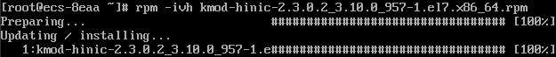

# 安装Linux特殊驱动

对于一些类型的云服务器，如果使用私有镜像进行创建，需要在制作私有镜像时安装特殊驱动。

## NVIDIA驱动

如果这个私有镜像用于创建P1型云服务器，需要在镜像中安装NVIDIA驱动，实现计算加速功能。安装操作请参见“[P1型云服务器安装NVIDIA驱动](https://support.huaweicloud.com/ims_faq/ims_faq_0033.html)”。

## InfiniBand网卡驱动

1.  如果这个私有镜像用于创建H2型云服务器，需要在镜像中安装InfiniBand网卡驱动。请根据IB类型，在Mellanox官网选择相应版本的InfiniBand网卡驱动下载（建议选择4.2-1.0.0.0的驱动版本下载使用），并根据Mellanox提供的操作指导进行安装。
    -   IB网卡类型：“Mellanox Technologies ConnectX-4 Infiniband HBA \(MCX455A-ECAT\)“
    -   Mellanox官网地址：[http://www.mellanox.com/](http://www.mellanox.com/)
    -   网卡驱动下载地址：[http://www.mellanox.com/page/products\_dyn?product\_family=26&mtag=linux\_sw\_drivers](http://www.mellanox.com/page/products_dyn?product_family=26&mtag=linux_sw_drivers)

## SRIOV驱动

如果这个私有镜像用于创建C6网络增强功能云服务器，需要在镜像中安装SRIOV驱动。当前仅EulerOS 2.3和CentOS 7.6操作系统支持安装SRIOV驱动，以适配C6网络增强功能。

> **说明：**   
>C6网络增强功能当前处于公测阶段，仅“华南-广州”区域“可用区3”支持公测。  

1.  登录云服务器，下载SRIOV驱动。

    **wget** _驱动下载链接_

    **表 1**  SRIOV驱动

    
    <table><thead align="left"><tr id="row1673812219017"><th class="cellrowborder" valign="top" width="21.602160216021602%" id="mcps1.2.4.1.1">
软件包

    </th>
    <th class="cellrowborder" valign="top" width="21.942194219421943%" id="mcps1.2.4.1.2">
适用操作系统

    </th>
    <th class="cellrowborder" valign="top" width="56.455645564556455%" id="mcps1.2.4.1.3">
获取方式

    </th>
    </tr>
    </thead>
    <tbody><tr id="row273911227018"><td class="cellrowborder" rowspan="2" valign="top" width="21.602160216021602%" headers="mcps1.2.4.1.1 ">
kmod-hinic.zip

    </td>
    <td class="cellrowborder" valign="top" width="21.942194219421943%" headers="mcps1.2.4.1.2 ">
EulerOS 2.3

    </td>
    <td class="cellrowborder" valign="top" width="56.455645564556455%" headers="mcps1.2.4.1.3 ">
<a href="https://ecs-instance-driver.obs.cn-north-1.myhuaweicloud.com/hinic/EulerOS2.3/kmod-hinic.zip" target="_blank" rel="noopener noreferrer">https://ecs-instance-driver.obs.cn-north-1.myhuaweicloud.com/hinic/EulerOS2.3/kmod-hinic.zip</a>

    </td>
    </tr>
    <tr id="row17739172218010"><td class="cellrowborder" valign="top" headers="mcps1.2.4.1.1 ">
CentOS 7.6

    </td>
    <td class="cellrowborder" valign="top" headers="mcps1.2.4.1.2 ">
<a href="https://ecs-instance-driver.obs.cn-north-1.myhuaweicloud.com/hinic/CentOS7.6/kmod-hinic.zip" target="_blank" rel="noopener noreferrer">https://ecs-instance-driver.obs.cn-north-1.myhuaweicloud.com/hinic/CentOS7.6/kmod-hinic.zip</a>

    </td>
    </tr>
    </tbody>
    </table>

2.  执行以下命令解压缩SRIOV驱动包。

    **unzip kmod-hinic.zip**

3.  执行以下命令安装驱动。

    **rpm -ivh** _rpm格式的安装程序名称_

    

4.  执行**modprobe hinic**命令加载驱动。
5.  执行**lsmod | grep hinic**命令验证驱动是否加载成功。如下图所示，如果可以查询到“hinic”表示程序安装成功并且可以正常加载。

    

6.  执行以下命令删除安装包。

    **rm** **-rf** _rpm格式的安装程序名称_

