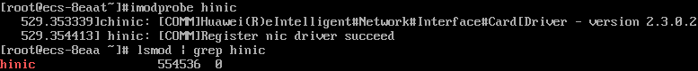

# 安装Linux特殊驱动

## 操作场景

对于一些类型的云服务器，如果使用私有镜像进行创建，需要在制作私有镜像时安装特殊驱动。

## InfiniBand网卡驱动

1.  如果这个私有镜像用于创建H2型云服务器，需要在镜像中安装InfiniBand网卡驱动。请根据IB类型，在Mellanox官网选择相应版本的InfiniBand网卡驱动下载（建议选择4.2-1.0.0.0的驱动版本下载使用），并根据Mellanox提供的操作指导进行安装。
    -   IB网卡类型：“Mellanox Technologies ConnectX-4 Infiniband HBA \(MCX455A-ECAT\)“
    -   Mellanox官网地址：[http://www.mellanox.com/](http://www.mellanox.com/)
    -   网卡驱动下载地址：[https://network.nvidia.com/products/infiniband-drivers/linux/mlnx\_ofed/](https://network.nvidia.com/products/infiniband-drivers/linux/mlnx_ofed/)
    -   H2型云服务器介绍：[超高性能计算型](https://support.huaweicloud.com/productdesc-ecs/ecs_01_0044.html)

## SRIOV驱动

私有镜像中安装SRIOV驱动，可以极大提高云服务器的网络处理性能。当前仅EulerOS 2.3和CentOS 7.6操作系统支持安装SRIOV驱动。

1.  登录云服务器，下载SRIOV驱动。

    **wget** _驱动下载链接_

    **表 1**  SRIOV驱动

|软件包|适用操作系统|获取方式|
|--|--|--|
|kmod-hinic.zip|EulerOS 2.3|https://ecs-instance-driver.obs.cn-north-1.myhuaweicloud.com/hinic/EulerOS2.3/kmod-hinic.zip|
|CentOS 7.6|https://ecs-instance-driver.obs.cn-north-1.myhuaweicloud.com/hinic/CentOS7.6/kmod-hinic.zip|

2.  执行以下命令解压缩SRIOV驱动包。

    **unzip kmod-hinic.zip**

3.  执行以下命令安装驱动。

    **rpm -ivh** _rpm格式的安装程序名称_

    

4.  执行**modprobe hinic**命令加载驱动。
5.  执行**lsmod | grep hinic**命令验证驱动是否加载成功。如下图所示，如果可以查询到“hinic”表示程序安装成功并且可以正常加载。

    

6.  执行以下命令删除安装包。

    **rm** **-rf** _rpm格式的安装程序名称_

