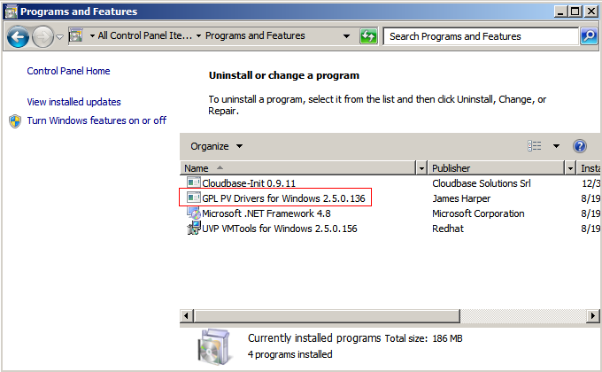

# 安装PV driver

## 操作场景

使用弹性云服务器或者外部镜像文件创建私有镜像时，必须确保操作系统中已安装PV driver，使新发放的云服务器支持XEN虚拟化，同时也可以提升云服务器的I/O处理性能、实现对云服务器硬件的监控和其他高级功能。

> **须知：**   
>如果不安装PV driver，云服务器的网络性能很差，并且安全组和防火墙也不会生效。因此，请您务必安装。  

使用公共镜像创建的云服务器默认已安装PV driver，您可以通过以下方法验证：

按如下目录打开“version”文件，检查操作系统中安装的PV driver的版本信息。

**C:\\Program Files \(x86\)\\Xen PV Drivers\\bin\\version**

-   如果PV driver的版本高于2.5版本，无需执行安装操作。
-   如果未查到PV driver版本信息，或者PV driver的版本低于或等于2.5版本，执行[安装PV driver](#zh-cn_topic_0036684067_section46181951)或[安装PV driver升级包](#section14208143620187)。

## 前提条件

-   云服务器已安装操作系统，并且已经绑定弹性公网IP。
-   云服务器的系统磁盘的剩余空间必须大于32MB。
-   如果云服务器的操作系统为Windows 2008，需使用Administrator用户安装PV driver。
-   云服务器已下载PV driver软件包。软件包获取请参考[相关软件及获取方式](相关软件及获取方式.md)。
-   为了避免在云服务器上安装PV driver失败，安装前需要：
    -   先卸载第三方虚拟化平台的工具（例如：Citrix Xen Tools、VMware Tools）。相关卸载方法请参考对应的工具的官方文档。
    -   禁用任何防病毒软件或入侵检测软件，安装完成后，您可以再次启用这些软件。

## 安装PV driver

1.  VNC登录Windows云服务器。

    登录云服务器的详细操作请参见“[Windows弹性云服务器登录方式概述](https://support.huaweicloud.com/usermanual-ecs/zh-cn_topic_0092494943.html)”。

    > **说明：**   
    >必须通过VNC方式登录云服务器，不可使用远程桌面登录方式，因为安装时会更新网卡驱动，远程桌面登录时网卡正在使用，从而导致安装不成功。  

2.  在云服务器操作系统界面，选择“开始 \> 控制面板”。
3.  单击“卸载程序”。
4.  按照提示，卸载“GPL PV Drivers for Windows x.x.x.xx”。
5.  根据[相关软件及获取方式](相关软件及获取方式.md)和云服务器的操作系统类型下载对应的PV driver版本。
6.  解压PV driver软件包。
7.  右键单击“GPL PV Drivers for Windows x.x.x.xx”，并选择“以管理员身份运行”，根据界面提示完成安装。
8.  根据提示重启云服务器，使PV driver生效。

    对于Windows Server 2008系统的云服务器，必须重启两次。

    > **说明：**   
    >安装PV driver后，云服务器网卡的配置信息会丢失，因此，若之前已配置网卡，需重新配置网卡信息。  

## 安装PV driver升级包

1.  VNC登录Windows云服务器。

    登录云服务器的详细操作请参见“[Windows弹性云服务器登录方式概述](https://support.huaweicloud.com/usermanual-ecs/zh-cn_topic_0092494943.html)”。

    > **说明：**   
    >必须通过VNC方式登录云服务器，不可使用远程桌面登录方式，因为安装时会更新网卡驱动，远程桌面登录时网卡正在使用，从而导致安装不成功。  

2.  在云服务器操作系统界面，选择“开始 \> 控制面板”。
3.  选择“程序 \> 卸载程序”，找到PV driver程序，将其卸载。
4.  卸载完成后请务必重启云服务器，以完成环境清理。
5.  下载pvdriver-windows.zip升级包。

    下载地址：[https://ecs-instance-driver.obs.myhwclouds.com/pvdriver-windows.zip](https://ecs-instance-driver.obs.myhwclouds.com/pvdriver-windows.zip)

6.  解压pvdriver-windows.zip升级包。
7.  单击setup.exe完成升级安装，且pvdriver-windows升级包会自动匹配当前操作系统版本。
8.  根据提示重启云服务器，使PV driver生效。

    对于Windows Server 2008系统的云服务器，必须重启两次。

    > **说明：**   
    >安装PV driver后，云服务器网卡的配置信息会丢失，因此，若之前已配置网卡，需重新配置网卡信息。  

## 验证安装成功

如果以下步骤验证成功，则表示PV driver安装成功。

1.  选择“开始 \> 控制面板 \> 程序和功能”。
2.  查看是否存在PV driver信息。

    如果存在则表示安装成功，如[图1](#fig16926124855714)所示。

    **图 1**  验证安装结果  
    

