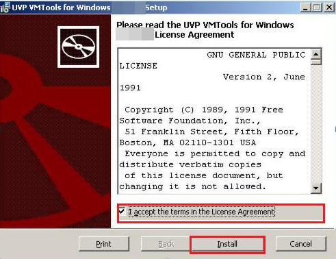

# 安装UVP VMTools

## 操作场景

使用弹性云服务器或者外部镜像文件创建私有镜像时，必须确保操作系统中已安装UVP VMTools，使新发放的云服务器支持KVM虚拟化，同时也可以提升云服务器的网络性能。

> **须知：**   
>如果不安装UVP VMTools，云服务器的网卡可能无法检测到，无法与外部通信。因此，请您务必安装。  

使用公共镜像创建的云服务器默认已安装UVP VMTools，您可以通过以下方法验证：

按如下目录打开“version”文件，检查操作系统中安装的UVP VMTools的版本信息。

**C:\\Program Files \(x86\)\\virtio\\bin\\version**

-   如果未查到UVP VMTools版本信息，请执行[安装UVP VMTools](#zh-cn_topic_0036684065_section12153337)或[安装UVP VMTools升级包](#section1817195995910)进行安装。
-   如果UVP VMTools的版本低于2.5.0版本，请执行[安装UVP VMTools升级包](#section1817195995910)。
-   如果UVP VMTools的版本高于或者等于2.5.0版本，则当前UVP VMTools可用。

## 前提条件

-   云服务器已经绑定弹性公网IP。
-   云服务器已经下载UVP VMTools的安装包，安装包的获取请参考[相关软件及获取方式](相关软件及获取方式.md)。
-   确保云服务器已经预留至少50M的磁盘空间。
-   为了避免在云服务器上安装UVP VMTools失败，安装前需要：
    -   先卸载第三方虚拟化平台的工具（例如：Citrix Xen Tools、VMware Tools）。相关卸载方法请参考对应的工具的官方文档。
    -   禁用任何防病毒软件或入侵检测软件，安装完成后，您可以再次启用这些软件。

## 安装UVP VMTools

以使用“vmtools-WIN2008R2-x64.zip”解压得到的“vmtools-WIN2008R2-x64.exe”安装程序为例介绍安装Tools的步骤。

1.  VNC登录Windows云服务器。

    登录云服务器的详细操作请参见“[Windows弹性云服务器登录方式概述](https://support.huaweicloud.com/usermanual-ecs/zh-cn_topic_0092494943.html)”。

    > **说明：**   
    >必须通过VNC方式登录云服务器，不可使用远程桌面登录方式，因为安装时会更新网卡驱动，远程桌面登录时网卡正在使用，从而导致安装不成功。  

2.  根据[相关软件及获取方式](相关软件及获取方式.md)和云服务器的操作系统类型下载对应的UVP VMTools版本。
3.  解压UVP Tools软件包。以使用“vmtools-WIN2008R2-x64.zip”解压得到的“vmtools-WIN2008R2-x64.exe”安装程序为例。
4.  右键单击“vmtools-WIN2008R2-x64.exe”，并选择“以管理员身份运行”，根据界面提示完成安装。
5.  当弹出安装提示窗口时，勾选“I accept the terms in the License Agreement”，单击“Install”。

    **图 1**  安装提示  
    

6.  按提示框进行工具安装，如下所示。
7.  Windows 2008安装步骤为：
    1.  安装过程中可能会弹出Windows安全对话框，如[图2](#fig47401118184018)，请勾选“Always trust...”，单击“Install”，否则将导致安装失败。

        **图 2**  windows安全  
        

    2.  然后单击“Finish”。

8.  请执行[验证安装成功](#zh-cn_topic_0036684065_section42271171)，验证UVP VMTools是否安装成功。

## 安装UVP VMTools升级包

1.  VNC登录Windows云服务器。

    登录云服务器的详细操作请参见“[Windows弹性云服务器登录方式概述](https://support.huaweicloud.com/usermanual-ecs/zh-cn_topic_0092494943.html)”。

    > **说明：**   
    >必须通过VNC方式登录云服务器，不可使用远程桌面登录方式，因为安装时会更新网卡驱动，远程桌面登录时网卡正在使用，从而导致安装不成功。  

2.  下载vmtool-windows.zip升级包。

    下载地址：[https://ecs-instance-driver.obs.myhwclouds.com/vmtools-windows.zip](https://ecs-instance-driver.obs.myhwclouds.com/vmtools-windows.zip)

3.  解压vmtool-windows.zip升级包，得到vmtool-windows.iso升级包。
4.  解压vmtool-windows.iso升级包，单击setup.exe完成升级安装，且vmtool升级包会自动匹配当前操作系统版本。
5.  请执行[验证安装成功](#zh-cn_topic_0036684065_section42271171)，验证UVP VMTools是否安装成功。

## 验证安装成功

如果以下步骤验证成功，则表示UVP VMTools安装成功。

1.  选择“开始 \> 控制面板 \> 程序和功能”。
2.  查看是否存在UVP VMTools信息。

    如果存在则表示安装成功，如[图3](#fig6404346182112)所示。

    **图 3**  验证安装结果  
    

