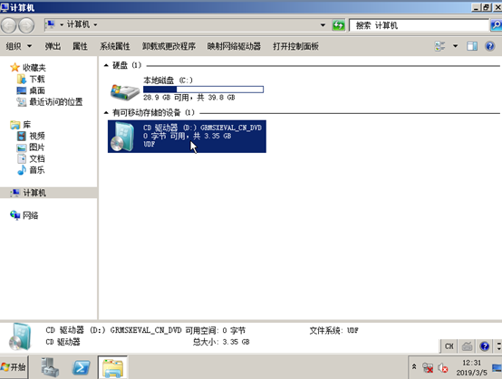

# 安装Windows操作系统和VMTools驱动

## 操作场景

该任务以“Windows Server 2008 R2 64位”操作系统为例，指导用户安装Windows操作系统。

由于镜像文件不同，安装步骤稍有不同，请根据实际的安装界面提示进行操作。

> **说明：**   
>请根据实际情况完成时区、KMS地址、补丁服务器、输入法、语言等相关配置。  

## 前提条件

已使用平台提供的“远程登录”方式（即noVNC），登录云服务器并进入安装界面。

## 操作步骤

> **须知：**   
>操作系统安装成功前，禁止关闭或重启弹性云服务器，否则会导致操作系统安装失败。  

1.  安装Windows操作系统。
    1.  在安装界面设置安装首选项，如[图1](#fig10825104318339)所示。

        **图 1**  安装首选项  
        

    2.  单击“下一步”。

        进入安装确认界面，如[图2](#fig1282534319337)所示。

        **图 2**  安装确认  
        

    3.  单击“现在安装”。

        进入“选择要安装的操作系统”界面，如[图3](#fig18825174317336)所示。

        **图 3**  版本选择  
        

    4.  选择待安装的操作系统版本，并单击“下一步”。

        进入“请阅读许可条款”界面，如[图4](#fig1826144316334)所示。

        **图 4**  许可条款  
        

    5.  勾选“我接受许可条款”，并单击“下一步”。

        进入“您想进行何种类型的安装？”界面，如[图5](#fig2826134393318)所示。

        **图 5**  安装类型  
        

    6.  选择“自定义（高级）”。

        进入“您想将Windows安装在何处？”界面。

        -   如果系统提示未查找到驱动器，如[图6](#fig12826104323319)所示，则执行[1.g](#li2827143133314)。

            **图 6**  安装位置  
            

        -   如果系统显示磁盘，如[图7](#fig14827144312333)所示，则执行[1.j](#li98272043173314)。

            **图 7**  安装位置  
            

    7.  依次单击“加载驱动程序 \> 浏览”。

        **图 8**  浏览  
        

    8.  根据如下路径，选择“viostor”并单击“确定”。

        浏览路径：vmtools-windows/upgrade/$OS\_Version/drivers/viostor

    9.  选择对应操作系统的驱动程序，并单击“下一步”。

        系统可能提供了多个驱动程序以供选择，请选择“VISOTOR.INF”，如[图9](#fig682744310335)所示。

        **图 9**  选择要要安装的驱动程序  
        

    10. 选择磁盘，并单击“下一步”。

        **图 10**  安装位置  
        

        > **说明：**   
        >如果磁盘类型为“脱机”状态，如[图11](#fig123371240185316)所示，需先关机并开机云服务器，然后再重新安装操作系统。  
        >**图 11**  磁盘脱机    
        >  

    11. 进入“正在安装Windows”界面，开始安装操作系统，如[图12](#fig4827124373319)所示。

        安装过程大约耗时50分钟，过程中云服务器会自动重启，请重新登录弹性云服务器并按照提示完成操作系统的后续配置。

        > **说明：**   
        >后续配置中，需要设置操作系统用户的密码。  
        >支持的特殊字符包括：!@$%^-\_=+\[\{\}\]:,./?  

        **图 12**  安装进度  
        

2.  安装相关驱动。
    1.  打开“计算机”，并双击驱动器，如[图13](#fig168111634103519)所示。

        **图 13**  打开驱动器  
        

    2.  双击打开“vmtools-windows”文件夹。

        **图 14**  打开“vmtools-windows”文件夹  
        

    3.  双击运行“Setup”文件。

        **图 15**  运行“Setup”文件  
        

    4.  根据界面提示进行驱动的安装。

        **图 16**  安装UVP VMTools for Windows  
        

    5.  驱动安装完成后，进入“设备管理器”，检查红框标注的驱动是否均安装成功。

        **图 17**  查看设备管理器  
        

