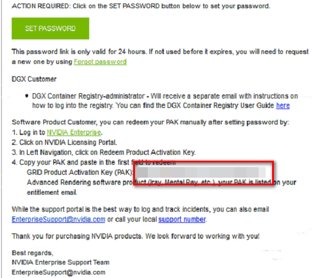
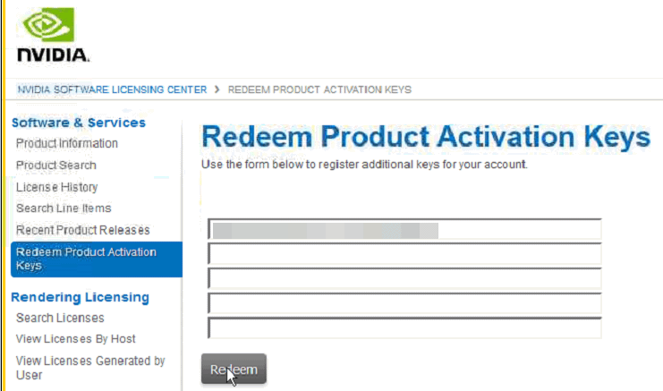

# 安装Windows特殊驱动\(可选\)

使用私有镜像创建弹性云服务器，需要在制作私有镜像时安装特殊驱动。

1.  使用私有镜像创建的G1型弹性云服务器，需在弹性云服务器创建完成后安装GPU驱动。其中，驱动下载地址：[http://www.nvidia.com/grid-eval](http://www.nvidia.com/grid-eval)，NVIDIA GRID版本选择“4.1”，软件包选择“GRID for UVP”，具体方法如下：
    1.  判断是否为首次注册使用nvidia。
        1.  是，执行[1.b](#zh-cn_topic_0097289624_zh-cn_topic_0035470098_li6493917120957)。
        2.  否，执行[1.d](#zh-cn_topic_0097289624_zh-cn_topic_0035470098_li31331234738)。

    2.  在注册nvidia用户成功的邮件中，查询PAK，如[图1](#zh-cn_topic_0097289624_zh-cn_topic_0035470098_fig4249148201328)所示。

        **图 1**  注册PAK  
        

    3.  将[1.b](#zh-cn_topic_0097289624_zh-cn_topic_0035470098_li6493917120957)中查找的PAK填写在“Redeem Product Activation Keys”页面 ，并单击“Redeem”。

        **图 2**  Redeem Product Activation Keys  
        

    4.  输入“用户名”和“密码”，并单击“登录”。

        **图 3**  登录NVIDIA官网  
        

    5.  根据界面提示，进入NVIDIA门户网站，并选择“Software & Services \> Product Information”。

    6.  选择“Archived Versions”页签。
    7.  单击“4.1”版本的“NVIDIA GRID”。
    8.  在“Product Download”页面，单击“GRID for UVP”。

2.  使用私有镜像创建的G3型弹性云服务器，需在弹性云服务器创建完成后安装GPU驱动。其中，驱动下载地址：[http://www.nvidia.com/grid-eval](http://www.nvidia.com/grid-eval)，NVIDIA GRID版本选择“4.1”，软件包选择“GRID for UVP”，具体方法如下：
    1.  判断是否为首次注册使用nvidia。
        1.  是，执行[2.b](#zh-cn_topic_0097289624_li19648193452318)。
        2.  否，执行[2.f](#zh-cn_topic_0097289624_li66651834172318)。

    2.  在注册nvidia用户成功的邮件中，查询PAK，如[图4](#zh-cn_topic_0097289624_fig16651634162316)所示。

        **图 4**  查询PAK  
        

    3.  将[2.b](#zh-cn_topic_0097289624_li19648193452318)中查找的PAK填写在“Redeem Product Activation Keys”页面 ，并单击“Redeem”。

        **图 5**  填写“Redeem Product Activation Keys”  
        

    4.  输入“用户名”和“密码”，并单击“登录”。

        **图 6**  登录NVIDIA  
        

    5.  根据界面提示，进入NVIDIA门户网站，并选择“Software & Services \> Product Information”。

    6.  选择“Archived Versions”页签。
    7.  单击“4.1”版本的“NVIDIA GRID”。
    8.  在“Product Download”页面，单击“GRID for UVP”。

