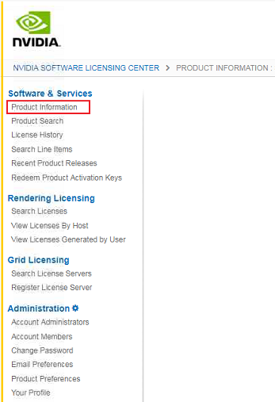
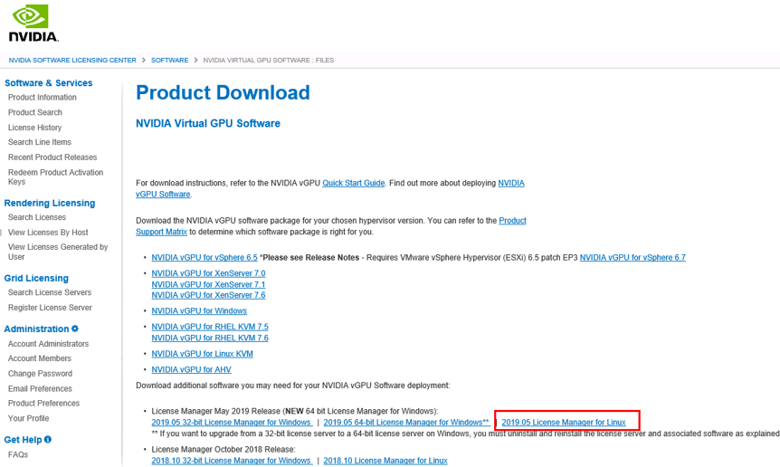

# 安装Windows特殊驱动

对于一些类型的弹性云服务器，如果使用私有镜像进行创建，需要在制作私有镜像时安装特殊驱动。

## GPU驱动

如果这个私有镜像用于创建GPU加速型云服务器，需要在镜像中安装合适的GPU驱动来获得相应的GPU加速能力。GPU加速型实例中配备的NVIDIA Tesla GPU支持两种类型的驱动：Tesla驱动和GRID/vGPU驱动。

-   如果需要使用OpenGL/DirectX/Vulcan等图形加速能力，则需要安装GRID/vGPU驱动并自行配置使用GRID License。此外，GRID/vGPU驱动配合vDWS类型License，也支持CUDA，用来满足既需要计算加速也需要图形加速的场景。
-   如果需要使用NVIDIA CUDA计算加速能力，则需要安装Tesla驱动。

1.  G1型弹性云服务器、G3型弹性云服务器请参考以下操作安装GRID驱动。
    1.  请根据[表1](#zh-cn_topic_0149610914_table230940145218)对应操作系统[下载驱动安装包](https://www.nvidia.com/grid-eval)。

        > **说明：**   
        >GPU直通型实例：根据需求选择GRID驱动版本。  
        >GPU虚拟化型实例：请严格按照下表选择合适的驱动版本下载使用。  

        **表 1**  GPU实例类型支持的GRID驱动版本

        
        <table><thead align="left"><tr id="zh-cn_topic_0149610914_row1230860145216"><th class="cellrowborder" valign="top" width="10.601060106010602%" id="mcps1.2.6.1.1">
实例类型

        </th>
        <th class="cellrowborder" valign="top" width="16.09160916091609%" id="mcps1.2.6.1.2">
GPU挂载方式

        </th>
        <th class="cellrowborder" valign="top" width="38.84388438843885%" id="mcps1.2.6.1.3">
操作系统

        </th>
        <th class="cellrowborder" valign="top" width="23.352335233523352%" id="mcps1.2.6.1.4">
驱动版本

        </th>
        <th class="cellrowborder" valign="top" width="11.111111111111112%" id="mcps1.2.6.1.5">
CPU架构

        </th>
        </tr>
        </thead>
        <tbody><tr id="zh-cn_topic_0149610914_row2030911017528"><td class="cellrowborder" valign="top" width="10.601060106010602%" headers="mcps1.2.6.1.1 ">
G5

        </td>
        <td class="cellrowborder" valign="top" width="16.09160916091609%" headers="mcps1.2.6.1.2 ">
GPU虚拟化型实例

        </td>
        <td class="cellrowborder" valign="top" width="38.84388438843885%" headers="mcps1.2.6.1.3 "><ul id="zh-cn_topic_0149610914_ul61637167455"><li>Windows Server 2016 Standard 64bit</li><li>Windows Server 2012 R2 Standard 64bit</li><li>CentOS 7.5 64bit</li></ul>
        </td>
        <td class="cellrowborder" valign="top" width="23.352335233523352%" headers="mcps1.2.6.1.4 ">
GRID 7.1: NVIDIA vGPU for Linux KVM

        </td>
        <td class="cellrowborder" valign="top" width="11.111111111111112%" headers="mcps1.2.6.1.5 ">
x86_64

        </td>
        </tr>
        <tr id="zh-cn_topic_0149610914_row1230917015528"><td class="cellrowborder" valign="top" width="10.601060106010602%" headers="mcps1.2.6.1.1 ">
G3

        </td>
        <td class="cellrowborder" valign="top" width="16.09160916091609%" headers="mcps1.2.6.1.2 ">
GPU直通型实例

        </td>
        <td class="cellrowborder" valign="top" width="38.84388438843885%" headers="mcps1.2.6.1.3 "><ul id="zh-cn_topic_0149610914_ul6665172318532"><li>Windows Server 2012 R2 Standard 64bit</li><li>Windows Server 2008 R2 Enterprise SP1 64bit</li></ul>
        </td>
        <td class="cellrowborder" valign="top" width="23.352335233523352%" headers="mcps1.2.6.1.4 ">
按需选择版本

        </td>
        <td class="cellrowborder" valign="top" width="11.111111111111112%" headers="mcps1.2.6.1.5 ">
x86_64

        </td>
        </tr>
        <tr id="zh-cn_topic_0149610914_row53092007529"><td class="cellrowborder" valign="top" width="10.601060106010602%" headers="mcps1.2.6.1.1 ">
G1

        </td>
        <td class="cellrowborder" valign="top" width="16.09160916091609%" headers="mcps1.2.6.1.2 ">
GPU虚拟化型实例

        </td>
        <td class="cellrowborder" valign="top" width="38.84388438843885%" headers="mcps1.2.6.1.3 "><ul id="zh-cn_topic_0149610914_ul1854703165713"><li>Windows Server 2012 R2 Standard 64bit</li><li>Windows Server 2008 R2 Enterprise SP1 64bit</li></ul>
        </td>
        <td class="cellrowborder" valign="top" width="23.352335233523352%" headers="mcps1.2.6.1.4 ">
vGPU 4.1：GRID for UVP

        </td>
        <td class="cellrowborder" valign="top" width="11.111111111111112%" headers="mcps1.2.6.1.5 ">
x86_64

        </td>
        </tr>
        <tr id="zh-cn_topic_0149610914_row374124202211"><td class="cellrowborder" valign="top" width="10.601060106010602%" headers="mcps1.2.6.1.1 ">
P2vs

        </td>
        <td class="cellrowborder" valign="top" width="16.09160916091609%" headers="mcps1.2.6.1.2 ">
GPU直通型实例

        </td>
        <td class="cellrowborder" valign="top" width="38.84388438843885%" headers="mcps1.2.6.1.3 "><ul id="zh-cn_topic_0149610914_ul154982303227"><li>Windows Server 2016 Standard 64bit</li><li>Ubuntu Server 16.04 64bit</li><li>CentOS 7.5 64bit</li></ul>
        </td>
        <td class="cellrowborder" valign="top" width="23.352335233523352%" headers="mcps1.2.6.1.4 ">
按需选择版本

        </td>
        <td class="cellrowborder" valign="top" width="11.111111111111112%" headers="mcps1.2.6.1.5 ">
x86_64

        </td>
        </tr>
        <tr id="zh-cn_topic_0149610914_row1383513813532"><td class="cellrowborder" valign="top" width="10.601060106010602%" headers="mcps1.2.6.1.1 ">
P2v

        </td>
        <td class="cellrowborder" valign="top" width="16.09160916091609%" headers="mcps1.2.6.1.2 ">
GPU直通型实例

        </td>
        <td class="cellrowborder" valign="top" width="38.84388438843885%" headers="mcps1.2.6.1.3 "><ul id="zh-cn_topic_0149610914_ul94948412537"><li>Windows Server 2016 Standard 64bit</li><li>Windows Server 2012 R2 Standard 64bit</li><li>Ubuntu Server 16.04 64bit</li><li>CentOS 7.4 64bit</li><li>EulerOS 2.2 64bit</li></ul>
        </td>
        <td class="cellrowborder" valign="top" width="23.352335233523352%" headers="mcps1.2.6.1.4 ">
按需选择版本

        </td>
        <td class="cellrowborder" valign="top" width="11.111111111111112%" headers="mcps1.2.6.1.5 ">
x86_64

        </td>
        </tr>
        <tr id="zh-cn_topic_0149610914_row1452816207544"><td class="cellrowborder" valign="top" width="10.601060106010602%" headers="mcps1.2.6.1.1 ">
P1

        </td>
        <td class="cellrowborder" valign="top" width="16.09160916091609%" headers="mcps1.2.6.1.2 ">
GPU直通型实例

        </td>
        <td class="cellrowborder" valign="top" width="38.84388438843885%" headers="mcps1.2.6.1.3 "><ul id="zh-cn_topic_0149610914_ul1740013273448"><li>Windows Server 2012 R2 Standard 64bit</li><li>Debian 8.0 64bit</li><li>Ubuntu Server 16.04 64bit</li><li>CentOS 7.3 64bit</li><li>EulerOS 2.2 64bit</li></ul>
        </td>
        <td class="cellrowborder" valign="top" width="23.352335233523352%" headers="mcps1.2.6.1.4 ">
按需选择版本

        </td>
        <td class="cellrowborder" valign="top" width="11.111111111111112%" headers="mcps1.2.6.1.5 ">
x86_64

        </td>
        </tr>
        <tr id="zh-cn_topic_0149610914_row1141201918615"><td class="cellrowborder" valign="top" width="10.601060106010602%" headers="mcps1.2.6.1.1 ">
Pi2

        </td>
        <td class="cellrowborder" valign="top" width="16.09160916091609%" headers="mcps1.2.6.1.2 ">
GPU直通型实例

        </td>
        <td class="cellrowborder" valign="top" width="38.84388438843885%" headers="mcps1.2.6.1.3 "><ul id="zh-cn_topic_0149610914_ul133951123362"><li>Windows Server 2016 Standard 64bit</li><li>Ubuntu Server 16.04 64bit</li><li>CentOS 7.5 64bit</li></ul>
        </td>
        <td class="cellrowborder" valign="top" width="23.352335233523352%" headers="mcps1.2.6.1.4 ">
按需选择版本

        </td>
        <td class="cellrowborder" valign="top" width="11.111111111111112%" headers="mcps1.2.6.1.5 ">
x86_64

        </td>
        </tr>
        <tr id="zh-cn_topic_0149610914_row1043032119565"><td class="cellrowborder" valign="top" width="10.601060106010602%" headers="mcps1.2.6.1.1 ">
Pi1

        </td>
        <td class="cellrowborder" valign="top" width="16.09160916091609%" headers="mcps1.2.6.1.2 ">
GPU直通型实例

        </td>
        <td class="cellrowborder" valign="top" width="38.84388438843885%" headers="mcps1.2.6.1.3 "><ul id="zh-cn_topic_0149610914_ul085442213511"><li>Ubuntu Server 16.04 64bit</li><li>Ubuntu Server 14.04 64bit</li><li>CentOS 7.3 64bit</li></ul>
        </td>
        <td class="cellrowborder" valign="top" width="23.352335233523352%" headers="mcps1.2.6.1.4 ">
按需选择版本

        </td>
        <td class="cellrowborder" valign="top" width="11.111111111111112%" headers="mcps1.2.6.1.5 ">
x86_64

        </td>
        </tr>
        </tbody>
        </table>

    2.  注册成功后，登录[NVIDIA官网](https://nvid.nvidia.com/dashboard/)，填写账户信息。
    3.  判断是否为首次注册使用NVIDIA。
        1.  是，执行[1.d](#zh-cn_topic_0149610914_li1859773663819)。
        2.  否，执行[1.f](#zh-cn_topic_0149610914_li0791101412396)。

    4.  在注册NVIDIA用户成功的邮件中，查询PAK，如[图1](#zh-cn_topic_0149610914_fig133361216153817)所示。

        **图 1**  注册PAK  
        

    5.  将[1.d](#zh-cn_topic_0149610914_li1859773663819)中查找的PAK填写在“Redeem Product Activation Keys”页面 ，并单击“Redeem”。

        **图 2**  Redeem Product Activation Keys  
        

    6.  输入“用户名”和“密码”，并单击“登录”。

        **图 3**  登录NVIDIA官网  
        

    7.  根据界面提示，进入NVIDIA门户网站，并选择“Software & Services \> Product Information”。

        **图 4**  Product Information  
        

    8.  选择“Archived Versions”页签。
    9.  对照[表1](#zh-cn_topic_0149610914_table230940145218)选择相应版本的GRID驱动下载。
    10. 解压缩GRID驱动包，并选择和弹性云服务器操作系统匹配的驱动进行安装。
    11. 在“Product Download”页面，单击“2019.05 License Manager for Linux”，下载License软件包。

        **图 5**  选择Product Information  
        

