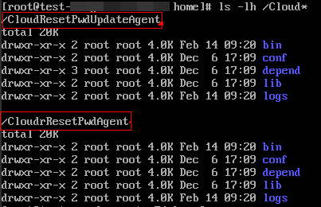

# 安装一键式重置密码插件（Linux）

## 操作场景

为了保证使用私有镜像创建的新云服务器可以实现一键式重置密码功能（参见“[在控制台重置云服务器密码](https://support.huaweicloud.com/usermanual-ecs/zh-cn_topic_0067909751.html#section2)”了解更多），建议您在创建私有镜像前安装密码重置插件CloudResetPwdAgent。

-   使用公共镜像创建的云服务器，默认已经安装密码重置插件，不需要执行安装操作。
-   使用外部镜像文件创建的云服务器，请按照指导安装密码重置插件。

## 安装须知

-   用户自行决定是否安装CloudResetPwdAgent插件，使云服务器具备一键式重置密码功能。
-   一键式重置密码插件CloudResetPwdAgent已按照GNU General Public License v2.0协议开源至[Github开源平台](https://github.com/huaweicloud/cloudresetpwdagent)，开放、透明、安全，请您放心使用。
-   支持安装一键式重置密码插件的操作系统版本如[表1](#table53992539710)所示。

    **表 1**  支持安装一键式重置密码插件的操作系统版本

    
    <table><thead align="left"><tr id="row939911531274"><th class="cellrowborder" valign="top" width="34.660000000000004%" id="mcps1.2.3.1.1">
操作系统类型

    </th>
    <th class="cellrowborder" valign="top" width="65.34%" id="mcps1.2.3.1.2">
操作系统版本

    </th>
    </tr>
    </thead>
    <tbody><tr id="row123991353674"><td class="cellrowborder" valign="top" width="34.660000000000004%" headers="mcps1.2.3.1.1 ">
CentOS

    </td>
    <td class="cellrowborder" valign="top" width="65.34%" headers="mcps1.2.3.1.2 ">
CentOS 7.3 64bit

    
CentOS 7.2 64bit

    
CentOS 7.0 64bit

    
CentOS 7.1 64bit

    
CentOS 6.9 64bit

    
CentOS 6.8 64bit

    
CentOS 6.8 32bit

    
CentOS 6.6 32bit

    
CentOS 6.6 64bit

    
CentOS 6.5 64bit

    
CentOS 6.4 64bit

    
CentOS 6.3 64bit

    </td>
    </tr>
    <tr id="row239945312717"><td class="cellrowborder" valign="top" width="34.660000000000004%" headers="mcps1.2.3.1.1 ">
Debian

    </td>
    <td class="cellrowborder" valign="top" width="65.34%" headers="mcps1.2.3.1.2 ">
Debian 9.0 64bit

    
Debian 8.8 64bit

    
Debian 8.2 64bit

    
Debian 7.5 64bit

    
Debian 7.5 32bit

    </td>
    </tr>
    <tr id="row43992531471"><td class="cellrowborder" valign="top" width="34.660000000000004%" headers="mcps1.2.3.1.1 ">
openSUSE

    </td>
    <td class="cellrowborder" valign="top" width="65.34%" headers="mcps1.2.3.1.2 ">
openSUSE 42.2 64bit

    
openSUSE 13.2 64bit

    
openSUSE Leap 42.2 64bit

    
openSUSE Leap 42.1 64bit

    </td>
    </tr>
    <tr id="row53991553475"><td class="cellrowborder" valign="top" width="34.660000000000004%" headers="mcps1.2.3.1.1 ">
SUSE

    </td>
    <td class="cellrowborder" valign="top" width="65.34%" headers="mcps1.2.3.1.2 ">
SUSE 12 SP2 64bit

    
SUSE 12 SP1 64bit

    
SUSE 11 SP4 64bit

    </td>
    </tr>
    <tr id="row173995531874"><td class="cellrowborder" valign="top" width="34.660000000000004%" headers="mcps1.2.3.1.1 ">
Ubuntu

    </td>
    <td class="cellrowborder" valign="top" width="65.34%" headers="mcps1.2.3.1.2 ">
Ubuntu 16.10 32bit

    
Ubuntu 16.04 32bit

    
Ubuntu Server 16.04 64bit

    
Ubuntu Server 14.04 64bit

    
Ubuntu Server 14.04 32bit

    </td>
    </tr>
    <tr id="row439912531471"><td class="cellrowborder" valign="top" width="34.660000000000004%" headers="mcps1.2.3.1.1 ">
EulerOS

    </td>
    <td class="cellrowborder" valign="top" width="65.34%" headers="mcps1.2.3.1.2 ">
EulerOS 2.2 64bit

    </td>
    </tr>
    <tr id="row63998536710"><td class="cellrowborder" valign="top" width="34.660000000000004%" headers="mcps1.2.3.1.1 ">
Fedora

    </td>
    <td class="cellrowborder" valign="top" width="65.34%" headers="mcps1.2.3.1.2 ">
Fedora 25 64bit

    
Fedora 24 64bit

    </td>
    </tr>
    <tr id="row139910531478"><td class="cellrowborder" valign="top" width="34.660000000000004%" headers="mcps1.2.3.1.1 ">
Oracle Linux

    </td>
    <td class="cellrowborder" valign="top" width="65.34%" headers="mcps1.2.3.1.2 ">
Oracle Linux 7.3 64bit

    
Oracle Linux 6.9 64bit

    
Oracle Linux 6.5 64bit

    </td>
    </tr>
    </tbody>
    </table>

## 前提条件

-   云服务器的状态为“运行中”。
-   需保证根目录可写入，且剩余空间大于300MB。
-   使用SUSE 11 SP4镜像创建的云服务器，内存需要大于等于4G时才能支持一键式重置密码功能。
-   云服务器使用的VPC网络DHCP不能禁用。
-   云服务器网络正常通行。
-   云服务器安全组出方向规则满足如下要求：

    -   协议：TCP
    -   端口范围：80
    -   远端地址：169.254.0.0/16

    如果您使用的是默认安全组出方向规则，则已经包括了如上要求，可以正常初始化。默认安全组出方向规则为：

    -   协议：ALL
    -   端口范围：ALL
    -   远端地址：0.0.0.0/16

## 操作步骤

1.  检查云服务器是否已安装密码重置插件CloudResetPwdAgent和CloudResetPwdUpdateAgent。

    提供如下两种方法供您检查。

    **方法一：在管理控制台查询**

    1.  登录ECS控制台。
        1.  登录管理控制台。
        2.  选择“计算 \> 弹性云服务器”。

    2.  选中待检查的弹性云服务器，并选择“操作”列下的“更多 \> 重置密码”。
        -   如果界面弹窗提示用户给云服务器重置密码，表示已安装一键式重置密码插件，结束。
        -   如果界面弹窗提示下载重置密码脚本并安装，表示未安装一键式重置密码插件，请继续执行步骤[2](#li38809653102352)进行安装。

    **方法二：登录弹性云服务器查询**

    1.  以root用户登录弹性云服务器。
    2.  执行以下命令，查询是否已安装CloudResetPwdAgent和CloudResetPwdUpdateAgent。

        **ls -lh /Cloud\***

        **图 1**  查询是否已安装一键式重置密码插件  
        

        检查结果是否如[图1](#fig10541015151310)所示。

        -   是，表示已安装一键式重置密码插件，结束。
        -   否，表示未安装一键式重置密码插件，请继续执行步骤[2](#li38809653102352)进行安装。

2.  下载一键式重置密码插件CloudResetPwdAgent。

    > **说明：** 
    >弹性云服务器需要绑定弹性公网IP才能自动更新一键式重置密码插件。

    下载并解压软件包CloudResetPwdAgent.zip。

    32位操作系统且为x86架构的下载地址：[https://cn-south-1-cloud-reset-pwd.obs.cn-south-1.myhuaweicloud.com/linux/32/reset\_pwd\_agent/CloudResetPwdAgent.zip](https://cn-south-1-cloud-reset-pwd.obs.cn-south-1.myhuaweicloud.com/linux/32/reset_pwd_agent/CloudResetPwdAgent.zip)

    64位操作系统且为x86架构的下载地址：[https://cn-south-1-cloud-reset-pwd.obs.cn-south-1.myhuaweicloud.com/linux/64/reset\_pwd\_agent/CloudResetPwdAgent.zip](https://cn-south-1-cloud-reset-pwd.obs.cn-south-1.myhuaweicloud.com/linux/64/reset_pwd_agent/CloudResetPwdAgent.zip)

    64位操作系统且为ARM架构的下载地址：[https://cn-south-1-cloud-reset-pwd.obs.cn-south-1.myhuaweicloud.com/arm/linux/64/reset\_pwd\_agent/CloudResetPwdAgent.zip](https://cn-south-1-cloud-reset-pwd.obs.cn-south-1.myhuaweicloud.com/arm/linux/64/reset_pwd_agent/CloudResetPwdAgent.zip)

3.  安装一键式重置密码插件。
    1.  执行以下命令，进入文件CloudResetPwdUpdateAgent.Linux。

        **cd CloudResetPwdAgent/CloudResetPwdUpdateAgent.Linux**

    2.  执行以下命令，添加文件setup.sh的运行权限。

        **chmod +x setup.sh**

    3.  执行以下命令，安装插件。

        **sudo sh setup.sh**

    4.  执行以下命令，检查密码重置插件是否安装成功。

        **service cloudResetPwdAgent status**

        **service cloudResetPwdUpdateAgent status**

        如果服务CloudResetPwdAgent和CoudResetPwdUpdateAgent的状态均不是“unrecognized service”，表示插件安装成功，否则安装失败。

        > **说明：** 
        >-   您也可以根据步骤[1](#li33181566102338)，检查密码重置插件是否安装成功。
        >-   如果密码重置插件安装失败，请检查安装环境是否符合要求，并重试安装操作。

