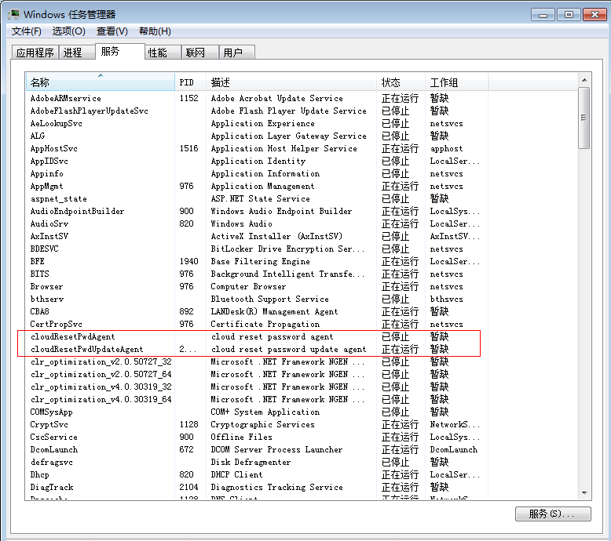

# 安装一键式重置密码插件（Windows）

## 操作场景

为了保证使用私有镜像创建的新云服务器可以实现一键式重置密码功能（参见“[在控制台重置云服务器密码](https://support.huaweicloud.com/usermanual-ecs/zh-cn_topic_0067909751.html#section2)”了解更多），建议您在创建私有镜像前安装密码重置插件CloudResetPwdAgent。

CloudResetPwdAgent安装包中包含CloudResetPwdAgent和CloudResetPwdUpdateAgent，请在下载并解压CloudResetPwdAgent安装包后依次安装。

-   使用公共镜像创建的云服务器，默认已经安装密码重置插件，不需要执行安装操作。
-   使用外部镜像文件创建的云服务器，请按照指导安装密码重置插件。

## 安装须知

-   用户自行决定是否安装CloudResetPwdAgent插件，使云服务器具备一键式重置密码功能。
-   一键式重置密码插件CloudResetPwdAgent已按照GNU General Public License v2.0协议开源至[Github开源平台](https://github.com/huaweicloud/CloudResetPwdAgent)，开放、透明、安全，请您放心使用。
-   支持安装一键式重置密码插件的操作系统版本如[表1](#table1813411428710)所示。

    **表 1**  支持安装一键式重置密码插件的操作系统版本

    
    <table><thead align="left"><tr id="row13118194215717"><th class="cellrowborder" valign="top" width="26.14%" id="mcps1.2.3.1.1">
操作系统类型

    </th>
    <th class="cellrowborder" valign="top" width="73.86%" id="mcps1.2.3.1.2">
操作系统版本

    </th>
    </tr>
    </thead>
    <tbody><tr id="row161341242774"><td class="cellrowborder" valign="top" width="26.14%" headers="mcps1.2.3.1.1 ">
Windows

    </td>
    <td class="cellrowborder" valign="top" width="73.86%" headers="mcps1.2.3.1.2 ">
Windows Server 2008 R2 Enterprise 64bit English

    
Windows Server 2008 R2 Enterprise 64bit 中文版

    
Windows Server 2008 R2 Standard 64bit English

    
Windows Server 2008 SP2 Enterprise 64bit

    
Windows Server 2008 R2 Datacenter 64bit

    
Windows Server 2008 R2 Standard 64bit

    
Windows Server 2012 R2 Standard 64bit English

    
Windows Server 2012 R2 Standard 64bit 中文版

    
Windows Server 2012 R2 Datacenter 64bit English

    
Windows Server 2012 R2 Datacenter 64bit 中文版

    
Windows Web Server 2008 R2 64bit

    
Windows 2008 Enterprise R2 64bit 英文版

    
Windows 2012 R2 Standard

    
Windows 2012 R2 Datacenter

    
Windows 2012 R2 Datacenter English

    
Windows 2012 R2 Standard English

    
Windows 2016 Datacenter 64bit 英文版

    
Windows 2016 Datacenter 64bit 中文版

    </td>
    </tr>
    </tbody>
    </table>

## 前提条件

-   云服务器的状态为“运行中”。
-   需保证C盘可写入，且剩余空间大于300MB。
-   云服务器使用的VPC网络DHCP不能禁用。
-   云服务器网络正常通行。
-   云服务器安全组出方向规则满足如下要求：

    -   协议：TCP
    -   端口范围：80
    -   远端地址：169.254.0.0/16

    如果您使用的是默认安全组出方向规则，则已经包括了如上要求，可以正常初始化。默认安全组出方向规则为：

    -   协议：ALL
    -   端口范围：ALL
    -   远端地址：0.0.0.0/16

## Windows云服务器安装方法

1.  检查云服务器是否已安装密码重置插件CloudResetPwdAgent和CloudResetPwdUpdateAgent。检查方法如下：

    查看任务管理器，如果找到cloudResetPwdAgent服务和cloudResetPwdUpdateAgent服务，如[图1](#fig2400635316290)所示，表示云服务器已安装密码重置插件。

    **图 1**  判断是否已安装插件  
    

    -   是，结束。
    -   否，执行[2](#li51861828102623)。

2.  下载一键式重置密码插件。

    > **说明：**   
    >云服务器需要绑定弹性公网IP才能自动更新一键式重置密码插件。  

    下载并解压软件包CloudResetPwdAgent.zip。

    下载地址：[http://cn-south-1-cloud-reset-pwd.obs.myhwclouds.com/windows/reset\_pwd\_agent/CloudResetPwdAgent.zip](http://cn-south-1-cloud-reset-pwd.obs.myhwclouds.com/windows/reset_pwd_agent/CloudResetPwdAgent.zip)

3.  安装一键式重置密码插件。
    1.  依次双击“CloudResetPwdAgent.Windows”和“CloudResetPwdUpdateAgent.Windows”文件夹下的“setup.bat”，安装密码重置插件。
    2.  查看任务管理器，检查密码重置插件是否安装成功。

        如果在任务管理器中查找到了cloudResetPwdAgent服务和cloudResetPwdUpdateAgent服务，表示安装成功，否则安装失败。

        > **说明：**   
        >如果密码重置插件安装失败，请检查安装环境是否符合要求，并重试安装操作。  

