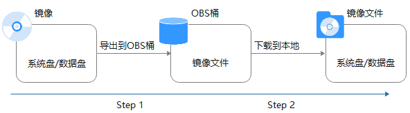

# 导出镜像

## 操作场景

创建私有镜像后，您可以导出镜像到OBS标准存储桶，并下载到本地使用。本文介绍导出镜像的操作步骤及相关注意事项。

## 背景知识

-   导出镜像的流程如下，适用于将云上的服务器系统及软件环境复制到线下集群或私有云环境使用。

    **图 1**  导出镜像流程  
    

-   导出镜像所需时间取决于私有镜像大小和当前导出任务的并发数，需要您耐心等待。
-   支持导出qcow2、vmdk、vhd和zvhd格式的镜像。在导出过程中，不同的格式会导致导出的镜像大小不同。
-   对于大于128G的镜像，您可以使用快速导出功能（即导出时需要勾选“使用快速导出”）将镜像导出到OBS桶中，但是无法指定导出格式，可以在镜像导出后，转换为需要的格式。

    > **说明：** 
    >加密镜像无法使用快速导出功能。

## 约束与限制

-   如下类型的私有镜像不允许导出：
    -   整机镜像
    -   ISO镜像
    -   Windows、SUSE公共镜像所创建的私有镜像
    -   市场镜像所创建的私有镜像

-   镜像大小必须小于1TB；大于128G的镜像仅支持快速导出。

## 前提条件

私有镜像所在区域中已有可用的OBS桶。

如果还未创建OBS桶，请先参考“[创建桶](https://support.huaweicloud.com/usermanual-obs/zh-cn_topic_0045829088.html)”进行创建，注意“存储类别”必须为“标准存储”。

> **说明：** 
>导出的镜像会产生一定的OBS存储费用。计费详情请参见“[OBS的收费标准](https://www.huaweicloud.com/pricing.html?tab=detail#/obs)”。

## 操作步骤

1.  登录IMS控制台。
    1.  登录管理控制台。
    2.  选择“计算 \> 镜像服务”。

        进入镜像服务页面。

2.  在私有镜像列表中，在需要导出的镜像所在行，单击操作列的“更多 \> 导出”。
3.  在“导出镜像”对话框中，填写如下参数：
    -   快速导出：大于128G的镜像必须勾选“使用快速导出”，勾选后将无法指定导出格式，只能为zvhd2格式。您可以在镜像导出后，使用qemu-img-hw工具转换为常见的镜像文件格式，具体操作步骤请参考“[通过qemu-img-hw工具转换镜像格式](https://support.huaweicloud.com/bestpractice-ims/ims_bp_0052.html)”。

        > **说明：** 
        >镜像导出和快速导出的区别，请参见[导入和快速导入、导出和快速导出功能对比](https://support.huaweicloud.com/ims_faq/faq_20191025_1.html)。

    -   格式：目前支持qcow2、vmdk、vhd、zvhd格式，请根据需要进行选择。
    -   名称：输入一个方便您识别的名称。
    -   存储路径：单击展开桶列表，选择一个用来存储镜像的OBS桶。

4.  单击“确定”。

    在私有镜像列表上方可以查看镜像导出任务进程。

## 后续步骤

镜像导出成功后，您可以在对象存储服务控制台，或者客户端的指定OBS桶中下载镜像文件。具体操作步骤请参见“[下载文件](https://support.huaweicloud.com/usermanual-obs/obs_03_0317.html)”。

