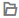

# 导出镜像

## 操作场景

当用户需要将私有镜像导出到指定存储设备或者想在其他平台使用此私有镜像时，可以使用镜像导出功能完成操作。

目前，支持用户将处在可用状态的私有镜像导出到OBS桶中并指定导出镜像的格式。用户可以通过对象存储服务将OBS桶中的镜像下载到指定存储。

在镜像导出过程中，不同的导出格式会导致镜像的大小不同，导出的镜像所占用的OBS存储空间以实际导出的镜像大小为准，对象存储服务会根据实际导出的镜像大小收取存储费用。

对于大于128G的镜像，支持用户使用快速导出功能将处在可用状态的私有镜像导出到OBS桶中，但是无法指定导出格式，您可以在镜像文件导出后，转换为常见的镜像文件格式

## 约束与限制

-   该操作仅支持标准存储桶。
-   支持用户导出自己上传的处在正常状态的私有镜像。
-   不支持用户导出Windows、SUSE操作系统的公共镜像和此类公共镜像创建的私有镜像。
-   整机镜像、ISO镜像不支持导出。
-   导出的镜像大小必须小于1TB；大于128G的镜像仅支持快速导出（即导出时需要勾选“使用快速导出”），但是无法指定导出格式。
-   加密镜像无法使用快速导出功能。
-   支持导出VMDK、VHD、QCOW2和ZVHD格式的镜像。
-   不允许导出备份创建的镜像。
-   不允许导出由市场镜像创建的云服务器所生成的私有镜像。

## 前提条件

已有OBS桶。

## 操作步骤

1.  登录管理控制台。
2.  选择“计算 \> 镜像服务”。

    进入镜像服务页面。

3.  在私有镜像列表中，在需要导出的镜像所在行，单击操作列的“更多 \> 导出”。
4.  在“导出镜像”对话框中，填写如下参数：
    -   快速导出：大于128G的镜像必须勾选“使用快速导出”，勾选后将无法指定导出格式，只能为zvhd2格式。您可以在镜像导出后，使用快速导入工具中的qemu-img-hw转换为常见的镜像文件格式，具体操作步骤请参考[3](快速导入镜像文件（基于Linux环境）.md#li2635823142815)。
    -   格式：目前支持qcow2、vmdk、vhd、zvhd格式，请根据需要进行选择。
    -   名称：输入一个方便您识别的名称。
    -   存储路径：单击展开桶列表，选择一个用来存储镜像的OBS桶。

5.  单击“确定”。

    在私有镜像列表上方可以查看镜像导出任务进程。镜像导出成功后，用户可以通过对象存储管理页面或客户端在指定OBS桶中下载镜像文件。

