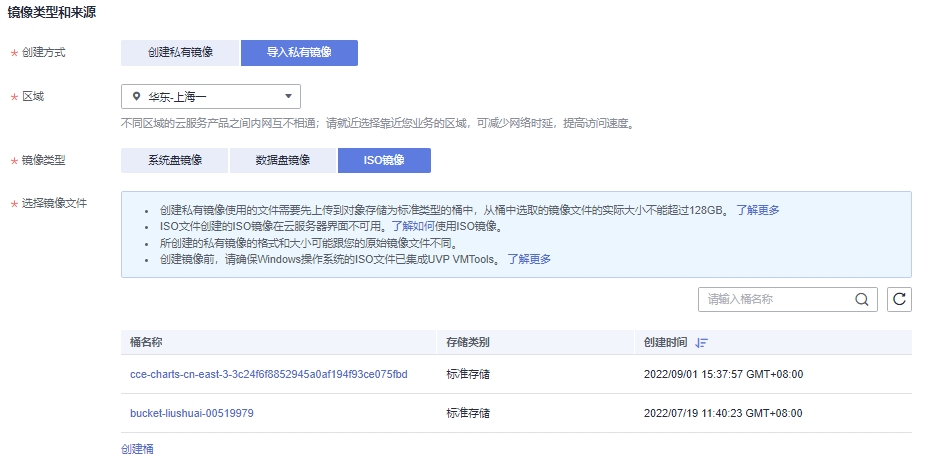

# 将ISO文件注册为镜像（Windows）

## 操作场景

通过注册镜像操作，将外部镜像ISO文件注册为云平台的私有镜像，即ISO镜像。注册镜像前，需先将[通过UltraISO为ISO文件集成VMTools驱动](通过UltraISO为ISO文件集成VMTools驱动.md)中保存的ISO文件上传到OBS桶中。

## 前提条件

-   待注册文件需为iso格式。
-   已上传ISO镜像文件到OBS的个人桶中。具体操作请参见[上传镜像文件（Windows）](上传镜像文件（Windows）.md)。

## 操作步骤

1.  登录管理控制台。
2.  选择“计算 \> 镜像服务”。

    进入镜像服务页面。

3.  单击右上角的“创建私有镜像”。

    进入创建私有镜像向导页面。

4.  在“镜像类型和来源”区域，选择镜像的创建方式为“ISO镜像”。
5.  从镜像文件列表中先选择保存ISO镜像文件的桶，再选择对应的ISO文件。如[图1](#fig133781627134913)所示。

    **图 1**  使用ISO文件创建私有镜像  
    

6.  在“配置信息”区域，填写镜像的基本信息。
    -   操作系统：选择ISO镜像文件对应的操作系统。为保证镜像的正常创建和使用，请确保选择的操作系统与镜像文件的操作系统类型一致。
    -   系统盘：设置系统盘容量，要求不小于镜像文件的系统盘大小。
    -   名称：输入镜像的名称。
    -   企业项目：选择资源所属的企业项目。
    -   标签：可选配置，根据需要为待创建私有镜像添加资源标签。
    -   描述：可选配置，根据需要输入描述信息。

7.  单击“立即创建”。
8.  根据界面提示，确认镜像参数。阅读并勾选《镜像制作承诺书》和《华为镜像免责声明》，单击“提交申请”。
9.  根据界面提示，返回私有镜像界面，查看创建的ISO镜像的状态。

    当镜像的状态为“正常”时，表示创建成功。

