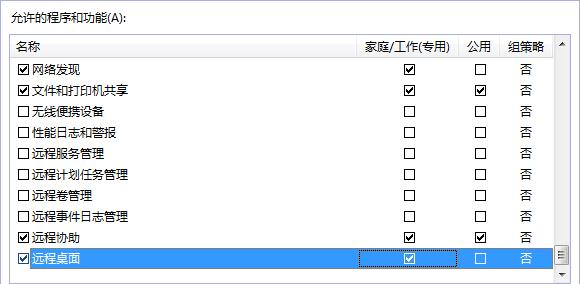

# 开启远程桌面连接功能

## 操作场景

对于需要使用Windows远程桌面连接方式进行访问的云服务器，需要在制作私有镜像时开启远程桌面连接功能。GPU优化型云服务器必须开启该功能。

> **说明：**   
>使用外部镜像文件制作私有镜像时，开启远程桌面连接操作需要在虚拟机内部完成，建议您在原平台的虚拟机实施修改后，再导出镜像。  

## 前提条件

已登录创建Windows私有镜像所使用的云服务器。

登录云服务器的详细操作请参见“[Windows弹性云服务器登录方式概述](https://support.huaweicloud.com/usermanual-ecs/zh-cn_topic_0092494943.html)”。

## 操作步骤

1.  开启远程桌面连接功能之前，建议先将云服务器的分辨率设置为1920×1080。

    设置方法：在云服务器操作系统单击“开始  \> 控制面板”，在“外观和个性化”区域单击“调整屏幕分辨率”，然后在“分辨率”下拉框中选择合适的值即可。

2.  单击“开始”，右键单击“计算机”，选择“属性”，进入“计算机属性”区域框。
3.  在左侧界面中，单击“远程设置”，进入“远程桌面”区域框。
4.  选择“允许运行任意版本远程桌面的计算机连接”。
5.  单击“确定”，返回“计算机属性”界面。
6.  选择“开始 \> 控制面板”，打开“Windows防火墙”。
7.  在左侧选择“允许程序或功能通过Windows防火墙”。
8.  根据用户网络的需要，配置“远程桌面”可以在哪种网络环境中通过Windows防火墙如[图1](#fig33349279102033)所示，然后单击下方的“确定”完成配置。

    **图 1**  配置“远程桌面”网络环境  
    

