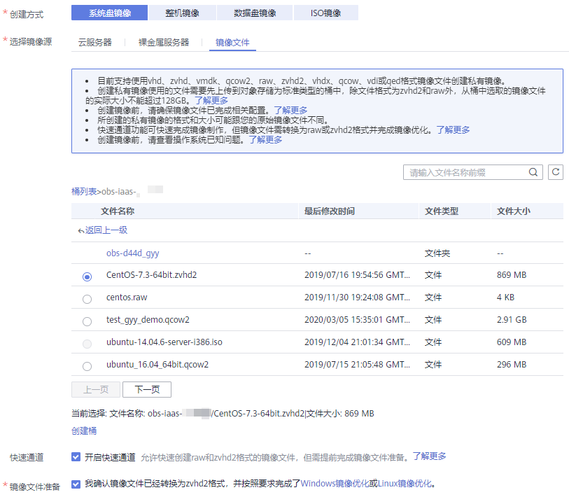

# 快速导入镜像文件（基于Windows环境）

## 操作场景

本节指导您基于Windows操作系统环境完成镜像文件快速导入，推荐使用Windows系统本地PC作为转换镜像格式和生成位表文件的环境。

Windows操作系统环境下，必须使用开源qemu-img工具进行镜像格式转换，qemu-img支持vhd、vmdk、qcow2、raw、vhdx、qcow、vdi或qed格式的镜像的相互转换，因此需要转换为raw格式，再使用快速导入工具中的CreateMF.jar生成位表文件。

## 前提条件

-   已完成镜像文件优化，详细操作请参考[优化过程（Windows）](优化过程（Windows）.md)或[优化过程（Linux）](优化过程（Linux）.md)；同时需要确保镜像文件符合[表1](准备镜像文件（Windows）.md#table85212269215)或[表1](准备镜像文件（Linux）.md#table85212269215)中的限制条件。

    > **说明：**   
    >根据镜像文件的操作系统类型来选择所参考内容。  

-   已在管理控制台创建OBS桶，并下载OBS Browser工具。

## 操作步骤

1.  安装开源镜像转换工具qemu-img，安装步骤请参考“[转换镜像格式](https://support.huaweicloud.com/bestpractice-ims/zh-cn_topic_0129707694.html)”。
2.  通过cmd命令进入qemu-img安装目录，执行qemu-img命令将镜像文件转换为raw格式。

    以将“image.qcow2”格式文件转换成“image.raw”格式为例：

    **qemu-img convert -p -O raw image.qcow2 image.raw**

3.  使用快速导入工具生成位表文件。
    1.  获取快速导入工具并解压。

        快速导入工具获取方式如下：

        **表 1**  快速导入工具压缩包

        
        <table><thead align="left"><tr id="row144501125172416"><th class="cellrowborder" valign="top" width="26.6%" id="mcps1.2.3.1.1">
工具包

        </th>
        <th class="cellrowborder" valign="top" width="73.4%" id="mcps1.2.3.1.2">
下载地址

        </th>
        </tr>
        </thead>
        <tbody><tr id="row6450325162418"><td class="cellrowborder" valign="top" width="26.6%" headers="mcps1.2.3.1.1 ">
quick-import-tools.rar

        </td>
        <td class="cellrowborder" valign="top" width="73.4%" headers="mcps1.2.3.1.2 ">
<a href="https://cn-south-1-cloud-reset-pwd.obs.myhwclouds.com/镜像快速导入工具/quick-import-tools.rar" target="_blank" rel="noopener noreferrer">https://cn-south-1-cloud-reset-pwd.obs.myhwclouds.com/%E9%95%9C%E5%83%8F%E5%BF%AB%E9%80%9F%E5%AF%BC%E5%85%A5%E5%B7%A5%E5%85%B7/quick-import-tools.rar</a>

        </td>
        </tr>
        </tbody>
        </table>

    2.  请确保当前环境已安装jdk。

        可通过如下方法验证：

        打开cmd.exe，执行**java -version**，若显示java版本信息，证明已安装jdk。

    3.  进入CreateMF.jar程序所在的路径。

        以将CreateMF.jar程序下载到“D:/test”目录为例，执行以下命令进入CreateMF.jar程序所在的路径：

        **D:**

        **cd test**

    4.  执行以下命令，生成raw格式镜像文件对应的位表文件。

        **java -jar CreateMF.jar D:/image01.raw D:/image01.mf**

4.  使用OBS Browser工具上传文件至OBS桶。

    必须将raw格式镜像文件及其位表文件上传至同一OBS桶。

5.  注册私有镜像。

    您可以通过控制台方式、API接口方式，将转换后的zvhd2或raw文件注册为私有镜像。

    **方法一：通过控制台创建私有镜像**

    1.  登录管理控制台。
    2.  选择“计算 \> 镜像服务”。

        进入镜像服务页面。

    3.  单击右上角的“创建私有镜像”。
    4.  在“镜像类型和来源”页面，选择镜像的创建方式为“系统盘镜像”或“数据盘镜像”。
    5.  镜像的源选择为“镜像文件”，从列表中选择转换为zvhd2或raw文件的桶，再选择转换后的镜像文件。如果是raw格式镜像文件，还需要选择位表文件。
    6.  勾选快速通道栏的“开启快速通道”，并确认已优化镜像文件，然后勾选“镜像文件准备”栏的内容。

        **图 1**  快速导入镜像文件  
        

    7.  根据界面提示填写配置信息。

        具体的配置参数说明，请参见[注册镜像（Windows）](注册镜像（Windows）.md)或[注册镜像（Linux）](注册镜像（Linux）.md)。

        > **须知：**   
        >-   操作系统必须要和镜像文件所含的操作系统一致。  
        >-   系统盘大小必须大于镜像文件的大小。  
        >    通过qemu-img-hw工具可查询镜像文件大小：  
        >    **qemu-img-hw** **info** _test.zvhd2_  

    **方法二：通过API方式创建私有镜像**

    您可以通过接口POST /v2/cloudimages/quickimport/action，实现镜像文件快速导入功能。

    该接口的具体调用方法，请参见“[镜像文件快速导入](https://support.huaweicloud.com/api-ims/zh-cn_topic_0133188204.html)”。

