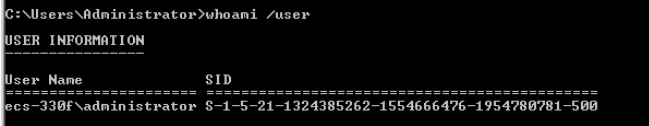
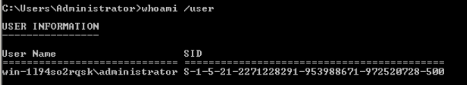

# 执行Sysprep

## 操作场景

执行Sysprep操作可以确保在云服务器加入域后SID唯一。

在Cloudbase-Init安装完成后，请确认云服务器是否需要加入域，或是否需要保证SID唯一。如果是，请按照本节指导执行Sysprep。

## 前提条件

-   请使用Administrator用户执行Sysprep。
-   一个全新激活的Windows云服务器每次最多执行一次Sysprep，不能连续多次执行。
-   如果云服务器是由镜像文件创建而来，那么仅支持使用原镜像自带的Sysprep版本，且Sysprep必须始终从“%WINDIR%\\system32\\sysprep”目录运行。
-   Windows必须保证是正版激活状态，并且必须保证剩余Windows重置计数大于等于1，否则不能执行Sysprep封装。

    在Windows命令行中输入以下命令，在“Windows Script Host”弹出窗中查看还能执行Sysprep的次数。

    **slmgr.vbs /dlv**

    当“剩余Windows重置计数”的值为0时，无法执行Sysprep。

    **图 1**  Windows Script Host  
    

## 操作步骤

1.  进入Cloudbase-Init工具安装路径。

    以Cloudbase-Init工具安装在“C:\\Program Files\\Cloudbase Solutions\\”目录下为例。请切换至C盘根目录下，执行以下命令，进入安装目录。

    **cd C:\\Program Files\\Cloudbase Solutions\\Cloudbase-Init\\conf**

2.  执行以下命令，对Windows系统进行封装。

    **C:\\Windows\\System32\\sysprep\\sysprep.exe /generalize /oobe /unattend:Unattend.xml**

    > **注意：** 
    >-   请务必在执行该命令时，包含“/unattend:Unattend.xml”，否则您当前云服务器的用户名密码等重要配置信息会被重置，后续使用该Windows私有镜像创建的云服务器启动后仍然需要手动执行操作系统设置。
    >-   执行完该命令后，云服务器会自动关机。请在关机后使用该云服务器创建镜像，可以保证后续使用该镜像创建的云服务器SID唯一。如果重新启动已经执行过Sysprep操作的Windows云服务器，则执行的Sysprep操作仅对当前云服务器生效，创建镜像前需要重新执行Sysprep操作。
    >-   对于Windows Server 2012以及Windows Server 2012 R2操作系统，当云服务器执行完Sysprep操作后，云服务器的Administrator帐号密码会被清除，请您登录云服务器后重新手动设置Administrator帐号的密码，此时在管理控制台界面中设置的云服务器密码将无效，请您妥善保管重新设置的密码。
    >-   使用的Windows操作系统需要采用域帐号登录时，请务必在创建私有镜像前执行Sysprep操作。执行Sysprep操作带来的影响请参考“[Windows操作系统制作私有镜像为什么要执行Sysprep操作？](https://support.huaweicloud.com/ims_faq/ims_faq_0024.html)”。
    >-   Windows云服务器中的Cloudbase-Init帐户为Cloudbase-Init代理程序的内置帐户，用于云服务器启动的时候获取元数据并执行相关配置。如果用户修改、删除此帐户或者卸载Cloudbase-Init代理程序会导致由此云服务器创建的Windows私有镜像所生成新的云服务器初始化的自定义信息注入失败。因此，不建议修改或删除Cloudbase-Init帐户。

    **图 2**  执行Sysprep操作  
    

## 后续操作

1.  使用执行完Sysprep操作后的云服务器创建私有镜像，具体操作请参考[通过云服务器创建Windows系统盘镜像](通过云服务器创建Windows系统盘镜像.md)。
2.  使用该镜像即可批量创建弹性云服务器，且所有新创建的云服务器具有唯一的SID。

    执行以下命令查询云服务器SID。

    **whoami /user**

    **图 3**  执行Sysprep前云服务器SID  
    

    **图 4**  执行Sysprep后云服务器SID  
    

