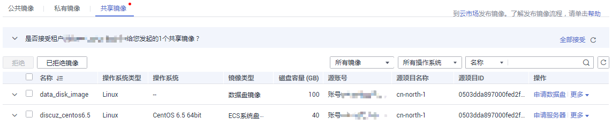
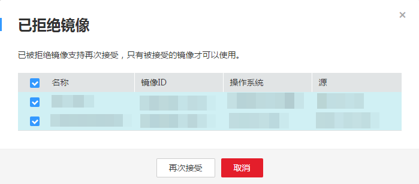

# 接受已经拒绝的共享镜像

## 操作场景

用户拒绝了其它用户共享的镜像后，如果再需要使用该共享镜像，可以将该共享镜像从自己的已拒绝镜像的列表中重新接受。

## 前提条件

-   已拒绝其他用户共享的镜像。
-   其它用户未取消共享该镜像。

## 操作步骤

1.  登录IMS控制台。
    1.  登录管理控制台。
    2.  选择“计算 \> 镜像服务”。

        进入镜像服务页面。

2.  单击“共享镜像”页签进入镜像列表页面。

    **图 1**  共享镜像  
    

3.  单击“已拒绝镜像”，弹出“已拒绝镜像”列表。

    **图 2**  已拒绝镜像  
    

4.  选择需要再次接受的镜像，单击“再次接受”。完成已拒绝共享镜像的重新接受。
5.  在“共享镜像”的镜像列表中可以查看步骤[4](#li3277469710524)中重新接受的镜像。

