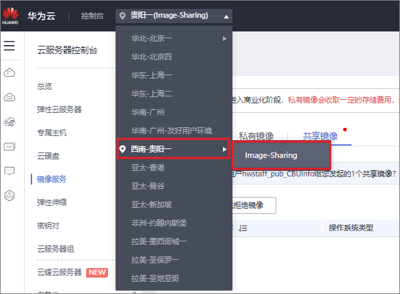
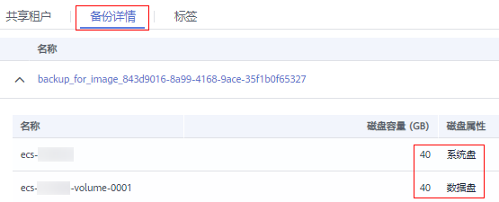
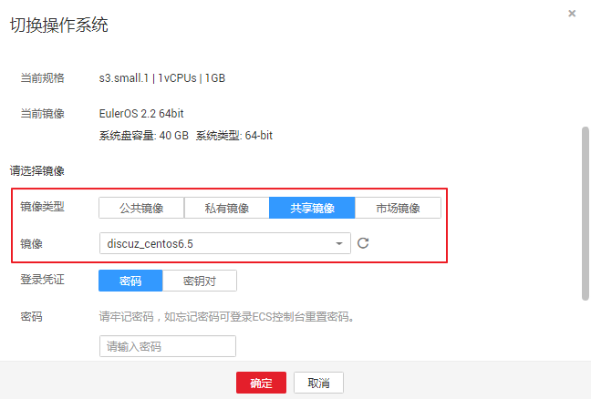

# 接受或拒绝共享镜像

## 操作场景

用户A完成共享指定镜像的操作后，用户B会收到是否接受镜像的提示。用户B可以选择接受全部或者部分镜像，也可以拒绝全部或者部分镜像。

> **说明：** 
>用户B所选的区域必须和用户A一致，否则看不到待接受的共享镜像。

## 前提条件

-   用户A已完成指定镜像的共享。
-   如果用户A共享的是整机镜像，那么B在接受前需要先创建云服务器备份存储库，作为存放整机镜像以及整机镜像所属备份的容器。注意，在创建云服务器备份存储库时，“保护类型”必须为“备份”。

## 操作步骤

1.  用户B登录IMS控制台。
    1.  登录管理控制台。
    2.  选择“计算 \> 镜像服务”。

        进入镜像服务页面。

2.  在左上角切换区域，将其切换为项目ID所在的区域。

    **图 1**  切换区域至“贵阳一 \> Image-Sharing”项目  
    

3.  单击“共享镜像”页签进入镜像列表页面。

    共享镜像列表上方提示用户B是否接受用户A共享的镜像。

    -   接受全部的共享镜像：单击右上角“全部接受”。
    -   接受部分镜像：勾选接受的共享镜像，单击“接受”。
    -   拒绝部分镜像：勾选拒绝的共享镜像，单击“拒绝”。

    > **说明：** 
    >如果在“共享镜像”页签未查看到镜像共享信息，请检查选择的区域是否正确。

4.  （可选）在“接受整机镜像”页面，选择一个保护类型为“备份”的云服务器备份存储库，并单击“确定”。

    **图 2**  接受整机镜像  
    

    当您接受的共享镜像为整机镜像时，该页面可见。

    由于备份共享功能的要求，整机镜像在接受共享前，需要先指定用于存储备份的存储库，且存储库容量应不小于整机镜像所关联云备份的磁盘容量（系统盘和数据盘容量总和）。存储库容量判断方式如下：

    1.  用户A单击待共享的整机镜像名称，进入镜像详情页面。
    2.  单击“备份详情”页签，查看整机镜像所关联云备份的磁盘容量，包括系统盘和数据盘容量总和。

        **图 3**  备份详情  
        

        以[图3](#fig1756319532036)为例，存储库容量不应小于80GB。

    > **说明：** 
    >更多关于存储库的信息，请参见“[什么是云备份](https://support.huaweicloud.com/productdesc-cbr/cbr_01_0002.html)”。

## 执行结果

-   待确认：对于用户B未及时处理（接受或拒绝）的共享镜像，该共享镜像处于待确认状态。

    待确认的共享镜像不会显示在共享镜像列表中。

-   接受：接受后，该镜像将显示在共享镜像列表中。用户B可以使用共享镜像列表中的镜像创建云服务器。
-   拒绝：拒绝后，该镜像不会显示在共享镜像列表中。您可以通过单击“已拒绝镜像”，查看被拒绝的共享镜像。被拒绝的镜像支持再次被接受。

## 后续操作

用户B接受用户A共享的系统盘镜像或整机镜像后，用户B可以进行以下操作：

-   使用共享镜像创建一台或多台云服务器，在选择镜像时，选择“共享镜像”即可。具体操作请参见“[自定义购买弹性云服务器](https://support.huaweicloud.com/qs-ecs/ecs_02_0009.html)”。
-   使用共享镜像为已有云服务器更换操作系统。具体操作请参见“[切换操作系统](https://support.huaweicloud.com/usermanual-ecs/zh-cn_topic_0031523135.html)”。

    **图 4**  切换操作系统  
    

用户B接受用户A共享的数据盘镜像后，用户B可以使用该镜像申请新的云硬盘，在共享镜像的操作列单击“申请数据盘”即可。

