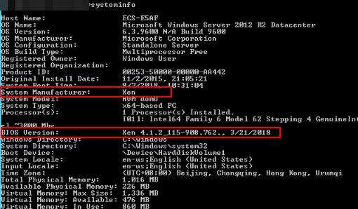

# 查看Windows操作系统云服务器虚拟化类型

您可以在cmd窗口输入以下命令，查看当前云服务器的虚拟化类型。

**systeminfo**

查看回显信息中System Manufacturer和BIOS版本显示为XEN，说明当前云服务器为XEN虚拟化类型，如果需要同时支持KVM虚拟化，请参考本章节操作优化Windows私有镜像。

**图 1**  查看Windows云服务器虚拟化类型  

