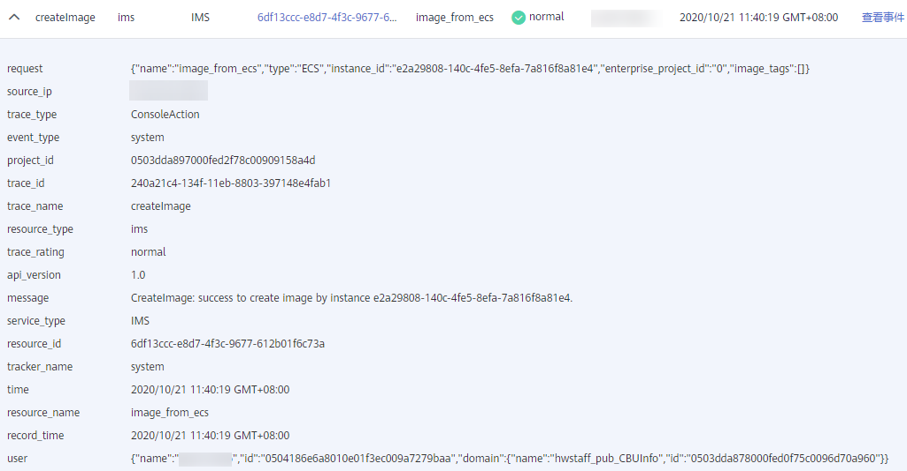

# 查看审计日志

## 操作场景

开启了云审计服务后，系统开始记录镜像服务相关的操作。云审计服务会保存最近1周的操作记录。

本小节介绍如何在云审计服务管理控制台查看最近1周的操作记录。

## 操作步骤

1.  登录管理控制台。
2.  单击“服务列表”，选择“管理与部署 \> 云审计服务”。
3.  单击左侧导航树的“事件列表”。
4.  事件记录了云资源的操作详情，设置筛选条件，单击“查询”。

    当前事件列表支持四个维度的组合查询，详细信息如下：

    -   事件类型、事件来源、资源类型和筛选类型。

        在下拉框中选择查询条件。其中，“事件类型”选择“管理事件”，“事件来源”选择“IMS”。

        **图 1**  设置筛选条件  
        

        其中，

        -   筛选类型选择“按资源ID”时，还需手动输入某个具体的资源ID，目前仅支持全字匹配模式的查询。
        -   筛选类型选择“按资源名称”时，还需选择或手动输入某个具体的资源名称。

    -   操作用户：在下拉框中选择某一具体的操作用户。
    -   事件级别：可选项为“所有事件级别”、“Normal”、“Warning”、“Incident”，只可选择其中一项。
    -   时间范围：可选项为“最近1小时”、“最近1天”、“最近1周”和“自定义时间段”，本示例选择“最近1周”。

5.  在需要查看的事件左侧，单击展开该事件的详细信息。

    **图 2**  展开事件  
    

6.  在需要查看的事件右侧，单击“查看事件”，弹出一个窗口，显示了该操作事件结构的详细信息。

    关于云审计事件结构的关键字段详解，请参见“[事件结构](https://support.huaweicloud.com/usermanual-cts/cts_03_0010.html)”。

