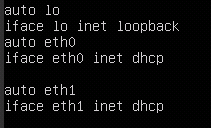
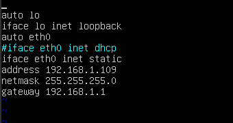

# 查看并设置云服务器

创建镜像前请配置弹性云服务器的网卡属性为DHCP方式。

## 操作场景

如果创建Linux私有镜像所使用的云服务器网络配置为静态IP地址，用户需要将该云服务器的网卡属性修改为DHCP方式。

不同操作系统配置方法略有区别，请参考对应操作系统的相关资料进行操作。

> **说明：**   
>开启网卡多队列具体操作请参考《弹性云服务器用户指南》。  

## 前提条件

已登录创建Linux私有镜像所使用的云服务器。

登录云服务器的相关操作请参见《弹性云服务器用户指南》。

## 操作步骤

-   Red Hat系列/CentOS系列/Oracle Enterprise Linux系列/EulerOS系列：使用VI编辑器在“/etc/sysconfig/network-scripts/ifcfg-ethX”配置文件中添加PERSISTENT\_DHCLIENT="y"。
-   Suse系列：使用VI编辑器将“/etc/sysconfig/network/dhcp”配置文件中的DHCLIENT\_USE\_LAST\_LEASE设置为no。
-   Ubuntu12.04：将dhclient升级为ISC dhclient 4.2.4以支持网卡持续DHCP获取IP地址能力。具体升级方法请参见操作系统相关文档。

本节操作以Ubuntu14.04操作系统为例，介绍检查及设置云服务器网卡属性的方法。

1.  在云服务器上执行以下命令，使用vi编辑器打开“/etc/network/interfaces”文件，查看网卡的网络配置。

    **vi /etc/network/interfaces**

    -   信息显示所有网卡的网络配置为DHCP模式时，如[图1](#zh-cn_topic_0029124465_fig56651987173613)所示，无需重复设置网卡属性，输入“:q”退出编辑器。

        **图 1**  网卡的网络配置为DHCP模式  
        

    -   信息显示网卡的网络配置为静态IP地址时，如[图2](#zh-cn_topic_0029124465_fig4727523517369)所示，请执行[2](#zh-cn_topic_0029124465_li47654828194142)。

        **图 2**  网卡的网络配置为静态IP地址  
        

2.  按“i”进入编辑模式。
3.  删除静态IP设置的相关内容，然后将对应的网卡设置为DHCP方式，如[图3](#zh-cn_topic_0029124465_fig9449703194420)所示。

    您也可以使用“\#”注释掉静态IP设置的相关内容。

    **图 3**  设置网卡为DHCP方式  
    

    如果您有多个网卡，请将剩余网卡按照上述方法设置为DHCP方式，如[图4](#zh-cn_topic_0029124465_fig29429713194459)所示。

    **图 4**  设置多个网卡为DHCP方式  
    

4.  按“ESC”后，输入“:wq”，按“Enter”。

    保存设置并退出编辑器。

5.  安装特殊驱动请参考[安装Linux特殊驱动（可选）](安装Linux特殊驱动（可选）.md)。

