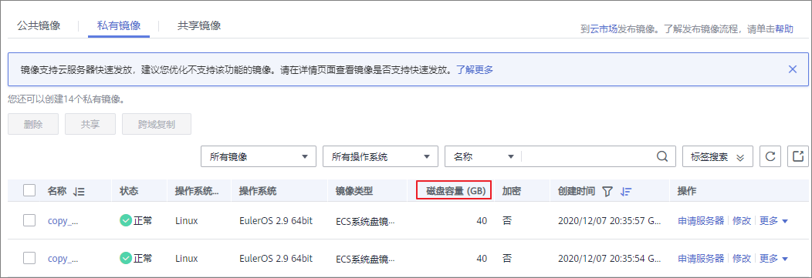

# 查看镜像的磁盘容量

## 操作场景

私有镜像创建成功后，您可以通过控制台直接查看镜像的磁盘容量。其中，整机镜像与其他私有镜像的磁盘容量查看方式略有不同：

-   查看系统盘镜像、数据盘镜像、ISO镜像的磁盘容量，请参考[查看磁盘容量（系统盘镜像/数据盘镜像/ISO镜像）](#section4605745191513)。
-   查看整机镜像的磁盘容量，请参考[查看磁盘容量（整机镜像）](#section712514158290)。

## 查看磁盘容量（系统盘镜像/数据盘镜像/ISO镜像）

对于系统盘镜像、数据盘镜像、ISO镜像的磁盘容量，可以通过控制台私有镜像列表中显示的“磁盘容量”直接查看。

1.  登录IMS控制台。
    1.  登录管理控制台。
    2.  选择“计算 \> 镜像服务”。

        进入镜像服务页面。

2.  选择“私有镜像”页签进入对应的镜像列表。
3.  在镜像所在行的“磁盘容量”列下，查看镜像的磁盘容量，单位为“GB“。

    **图 1**  查看磁盘容量（系统盘镜像/数据盘镜像/ISO镜像）  
    

## 查看磁盘容量（整机镜像）

整机镜像的磁盘容量，需通过查看创建整机镜像的备份获取。用于创建整机镜像的备份中系统盘容量+数据盘容量之和，即为整机镜像的磁盘容量。

1.  登录IMS控制台。
    1.  登录管理控制台。
    2.  选择“计算 \> 镜像服务”。

        进入镜像服务页面。

2.  选择“私有镜像”页签进入对应的镜像列表。

    在镜像所在行的“磁盘容量”列下，发现整机镜像的磁盘容量显示为“--“，未显示磁盘容量值。

    **图 2**  查看磁盘容量（整机镜像）  
    

3.  单击整机镜像的名称，进入详情页。
4.  选择镜像详情下方的“备份详情”页签，查看备份中系统盘、数据盘的容量。整机镜像的磁盘容量即为备份中系统盘容量与数据盘容量之和。

    整机镜像的磁盘容量=备份中系统盘的磁盘容量+备份中数据盘的磁盘容量

    假设备份详情中显示：

    -   系统盘的磁盘容量为40GB，没有数据盘，则整机镜像的磁盘容量为40GB。

        **图 3**  查看备份详情  
        

    -   系统盘的磁盘容量为40GB，数据盘的磁盘容量为40GB，则整机镜像的磁盘容量为80GB。

        **图 4**  查看备份详情  
        

