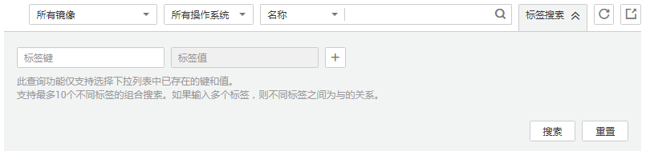
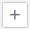

# 标记镜像

## 操作场景

用户可以使用“镜像标签”对镜像进行分类。您可以增加、修改或删除镜像标签，也可以在镜像列表中按标签搜索需要的镜像。

> **说明：** 
>镜像添加标签和使用标签搜索镜像时，查询预定义标签需要申请标签管理服务（Tag Management Service，TMS）的访问权限。

## 约束与限制

一个镜像最多添加10个标签。

## 镜像标签的增、删、改

1.  登录IMS控制台。
    1.  登录管理控制台。
    2.  选择“计算 \> 镜像服务”。

        进入镜像服务页面。

2.  选择“私有镜像”页签，单击镜像名称查看镜像详情。
    -   修改镜像标签，请执行[3](#zh-cn_topic_0029124542_li41380655103827)。

    -   删除镜像标签，请执行[4](#li29841739193722)。
    -   增加镜像标签，请执行[5](#li185112015308)。

3.  在镜像详情里，单击“标签”页签，在“镜像标签”列表中选择一个标签，单击“编辑”，对镜像标签进行修改。
4.  在镜像详情里，单击“标签”页签，在“镜像标签”列表中选择一个标签，单击“删除”，单击“确定”，完成对镜像标签的删除。
5.  在镜像详情里，单击“标签”页签，单击“添加标签”，在“添加标签”对话框中增加新的镜像标签。

## 按标签搜索私有镜像

1.  登录IMS控制台。
    1.  登录管理控制台。
    2.  选择“计算 \> 镜像服务”。

        进入镜像服务页面。

2.  选择“私有镜像”页签，单击右上角的“标签搜索”，展开查询页。

    **图 1**  按标签搜索  
    

3.  输入待查询私有镜像的标签。

    标签键和标签值均不能为空，当标签键和标签值全匹配时，系统可以自动查询到目标私有镜像。

4.  单击添加标签。

    系统支持不同标签的组合搜索，并取各个标签的交集。

5.  单击“搜索”。

    系统根据标签键或标签值搜索目标私有镜像。

