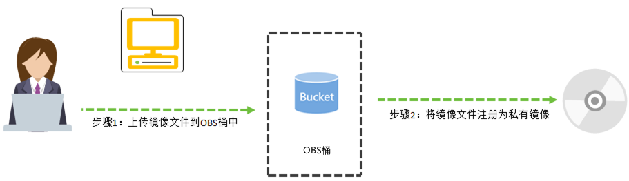
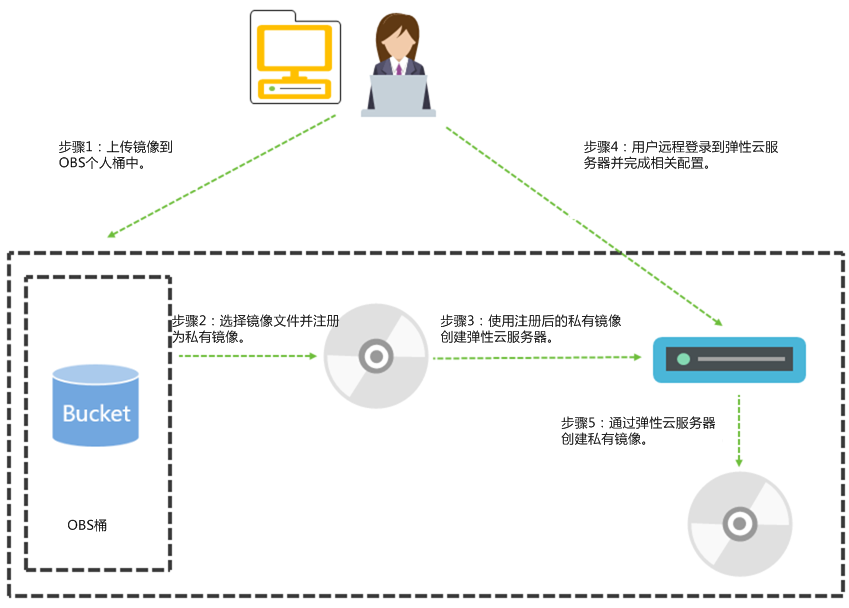

# 概述

用户可以将外部镜像文件创建为云平台的Linux私有镜像。

## 应用场景

当用户拥有Linux操作系统的外部镜像文件，且镜像文件的类型和操作系统符合外部镜像文件的镜像格式和操作系统类型，用户可以将外部镜像文件创建为云平台上的Linux私有镜像。

> **说明：**   
>该特性目前不支持东北区。  

## 创建过程

镜像的初始化配置需要清理网络规则文件、设置网卡属性、安装并配置Cloud-init工具等。

具体操作请参考[创建私有镜像前，云服务器或镜像文件需要完成哪些初始化配置？](http://support.huaweicloud.com/ims_faq/ims_faq_0022.html)

通过外部镜像文件创建私有镜像的过程按照上传的镜像文件是否完成初始化配置分为两种。

-   外部镜像文件已经完成初始化配置，创建私有镜像的过程如[图1](#fig20695097165955)所示。

    **图 1**  镜像文件已完成初始化配置  
    

    步骤说明如下：

    1.  上传外部镜像文件到OBS个人桶中，请参考[上传外部镜像文件\(Linux\)](上传外部镜像文件(Linux).md)。
    2.  通过管理控制台选择上传的镜像文件，并将镜像文件注册为私有镜像，请参考[注册镜像\(Linux\)](注册镜像(Linux).md)。

-   外部镜像文件未完成初始化配置，创建私有镜像的过程如[图2](#fig13042650171714)所示。

    **图 2**  镜像文件未完成初始化配置  
    

    步骤说明如下：

    1.  上传外部镜像文件到OBS个人桶中，请参考[上传外部镜像文件\(Linux\)](上传外部镜像文件(Linux).md)。
    2.  通过管理控制台选择上传的镜像文件，并将镜像文件注册为未初始化的私有镜像，请参考[注册镜像\(Linux\)](注册镜像(Linux).md)。
    3.  使用未初始化的私有镜像创建云服务器，请参考[创建云服务器\(Linux\)](创建云服务器(Linux).md)。
    4.  远程登录[3](#zh-cn_topic_0029343612_zh-cn_topic_0029124474_l83408cf4397e4476b7eacfaf488c34f2)创建的云服务器进行配置，请参考[配置云服务器\(Linux\)](配置云服务器(Linux).md)。

        > **说明：**   
        >运行在云平台的Linux云服务器需要使用xen-pv以及virtio原生驱动并装载到initrd。  

    5.  通过云服务器创建正常状态的私有镜像，请参考[通过云服务器创建镜像\(Linux\)](通过云服务器创建镜像(Linux).md)。

## 约束和限制

-   QCOW2格式的镜像文件必须没有加密属性。
-   外部镜像文件中必须包含系统盘。
-   外部镜像文件的大小必须不超过1TB，当镜像文件大于128GB时，需将镜像文件格式换为ZVHD2或RAW格式后才可以使用快速导入功能导入外部镜像文件。
    -   快速导入功能仅支持导入RAW或ZVHD2格式的镜像文件，镜像文件大小不能超过1TB。
    -   使用快速导入功能导入RAW格式镜像文件前，要求镜像文件已完成了镜像优化，且已生成传位表文件。
    -   使用快速导入功能导入ZVHD2格式镜像文件前，要求镜像文件已完成了镜像优化。

-   对于Linux操作系统，“/etc/fstab”文件中必须不包含自动挂载用户盘的配置项，否则创建的云服务器可能无法正常登录。
-   用于创建私有镜像的源云服务器系统盘大小大于等于40GB且不超过1024GB。
-   请确保镜像文件中已经设置或包含登录该镜像所创建云服务器的密码或证书，或者在镜像文件系统中已经安装并配置了Cloud-init。
-   Linux操作系统的镜像必须包含您可以正常登录的root用户和密码。在创建私有镜像过程中，您可能会使用相应的账户名和密码登录云服务器进行相关配置。
-   为避免使用该镜像文件导出的云服务器被攻击，请确保镜像文件的初始密码至少包含以下4种字符：
    -   大写字母
    -   小写字母
    -   数字
    -   特殊字符，包括!@$%^-\_=+\[\{\}\]:,./?

-   镜像支持IDE和PVOPS设备驱动，并且驱动在系统启动时自动加载。
-   镜像启动分区和系统分区必须都包含在同一个磁盘中。
-   镜像引导方式必须为BIOS而不是UEFI的引导方式。
-   如果外部镜像文件的磁盘采用了特定的加密机制，则可能会导致镜像注册后创建的云服务器无法正常使用。
-   因为一些默认驱动在云平台使用，所以不支持使用包含OEM类的操作系统的外部镜像文件创建私有镜像。
-   外部镜像文件中的操作系统不可以与特定的硬件绑定。
-   外部镜像文件中的操作系统必须支持全虚拟化。
-   如果外部镜像文件的系统盘为LVM设备，通过镜像文件创建的私有镜像创建弹性云服务器时不支持文件注入。
-   上传外部镜像文件到OBS桶时，OBS桶和镜像文件的存储类别必须是OBS标准存储。

