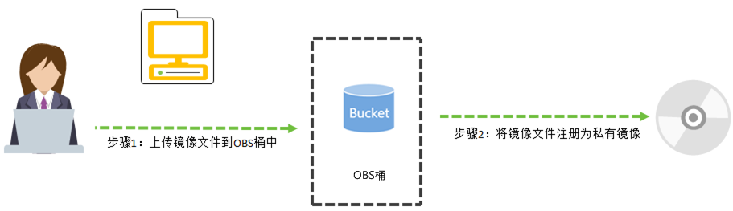
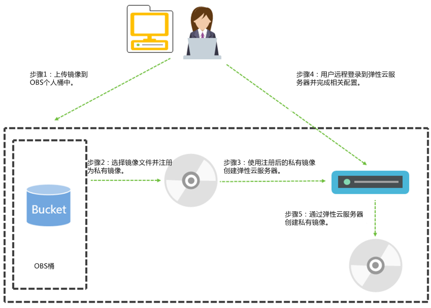

# 概述

用户可以将外部镜像文件创建为云平台的Windows私有镜像。

## 操作场景

用户可以将外部镜像文件创建为云平台的Windows私有镜像。

当用户拥有Windows操作系统的外部镜像文件，且镜像文件的类型和操作系统符合外部镜像文件的镜像格式和操作系统类型要求时，用户可以将外部镜像文件创建为云平台的Windows私有镜像。

## 创建过程

镜像的初始化配置需要配置网络属性、安装Cloudbase-init工具、配置“远程桌面”、安装Guest OS driver等。具体操作请参考[创建私有镜像前，云服务器或镜像文件需要完成哪些初始化配置？](https://support.huaweicloud.com/ims_faq/ims_faq_0022.html)

通过外部镜像文件创建私有镜像的过程按照上传的镜像文件是否完成初始化配置分为两种。

-   外部镜像文件已经完成初始化配置，创建私有镜像的过程如[图1](#fig20695097165955)所示。

    **图 1**  使用已完成初始化配置的镜像文件创建私有镜像  
    

    步骤说明如下：

    1.  上传外部镜像文件到OBS个人桶中，请参考[上传外部镜像文件（Windows）](上传外部镜像文件（Windows）.md)。
    2.  通过管理控制台选择上传的镜像文件，并将镜像文件注册为私有镜像，请参考[注册镜像（Windows）](注册镜像（Windows）.md)。

-   外部镜像文件未完成初始化配置，创建私有镜像的过程如[图2](#zh-cn_topic_0029124474_fig709741017158)所示。

    **图 2**  使用外部镜像文件创建私有镜像过程  
    

    步骤说明如下：

    1.  上传外部镜像文件到OBS个人桶中，请参考[上传外部镜像文件（Windows）](上传外部镜像文件（Windows）.md)。
    2.  通过管理控制台选择上传的镜像文件，并将镜像文件注册为未初始化的私有镜像，请参考[注册镜像（Windows）](注册镜像（Windows）.md)。
    3.  使用未初始化的私有镜像创建云服务器，请参考[创建云服务器（Windows）](创建云服务器（Windows）.md)。
    4.  远程登录[3](#li16524226172935)创建的云服务器进行配置，请参考[配置云服务器（Windows）](配置云服务器（Windows）.md)。

        > **说明：**   
        >运行在云平台的Windows云服务器必须安装Guest OS driver。  

        登录云服务器的相关操作请参见《弹性云服务器用户指南》。

    5.  通过云服务器创建私有镜像，请参考[通过云服务器创建镜像（Windows）](通过云服务器创建镜像（Windows）.md)。

## 约束和限制

-   QCOW2格式的镜像文件必须没有加密属性。
-   外部镜像文件中必须包含系统盘。
-   外部镜像文件的大小必须不超过128GB。（当前快速导入功能支持上传大于128GB的镜像文件，但快速导入仅支持ZVHD2或RAW格式的镜像文件。）
-   用于创建私有镜像的源云服务器系统盘大小大于等于40GB且不超过1024GB。
-   Windows操作系统的外部镜像文件必须包含可用的Administrator账户和密码。在创建私有镜像过程中，您可能会使用相应的账户名和密码登录云服务器进行相关配置。
-   镜像支持IDE设备驱动，并且驱动在系统启动时自动加载。
-   镜像启动分区和系统分区必须都包含在同一个磁盘中。
-   镜像引导方式必须为BIOS而不是UEFI的引导方式。
-   请确保镜像文件中已经设置或包含登录该镜像所创建云服务器的密码或证书，或者在镜像系统中已经安装并配置了cloudbase-init。
-   为避免使用该镜像文件导出的云服务器被攻击，请确保镜像文件的初始密码至少包含以下4种字符：
    -   大写字母
    -   小写字母
    -   数字
    -   特殊字符，包括!@$%^-\_=+\[\{\}\]:,./?

-   如果外部镜像文件的磁盘采用了特定的加密机制，则可能会导致镜像注册后创建的云服务器无法正常使用。
-   因为一些默认驱动在云平台无法使用，所以不支持使用包含OEM类的操作系统的外部镜像文件创建私有镜像。
-   外部镜像文件中的操作系统不可以与特定的硬件绑定。
-   外部镜像文件中的操作系统必须支持全虚拟化。
-   上传外部镜像文件到OBS桶时，OBS桶和镜像文件的存储类别必须是OBS标准存储。

