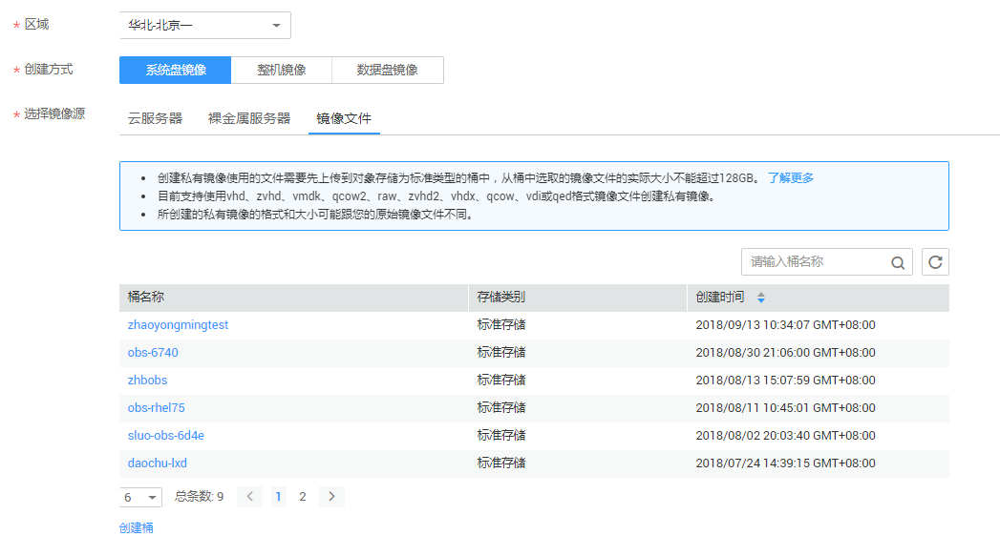
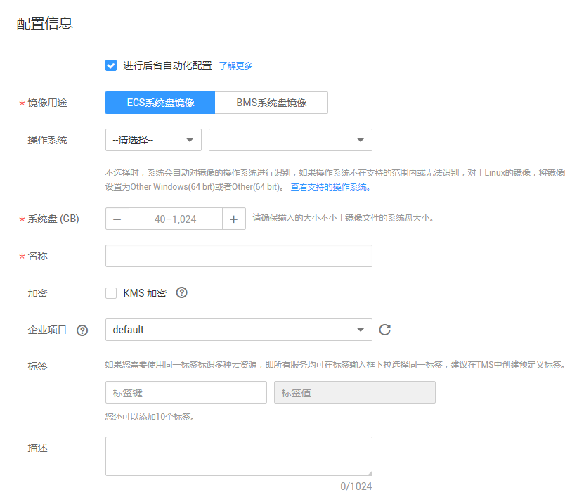

# 注册镜像\(Windows\)

用户可以通过注册镜像将外部镜像文件注册为云平台的私有镜像。

## 操作场景

-   用户可以将未完成初始化配置的镜像文件注册为云平台的未初始化私有镜像。
-   或者将已完成初始化配置的镜像文件注册为正常状态的私有镜像。

## 前提条件

已上传镜像文件到OBS的个人桶中。

## 操作步骤

1.  登录管理控制台。
2.  选择“计算 \> 镜像服务”。
3.  在“镜像服务”列表页面，单击“创建私有镜像”。
4.  在“镜像类型和来源”页面，选择镜像的创建方式为“系统盘镜像”。
5.  镜像的源选择为“文件”，从列表中先选择保存镜像文件的桶，再选择对应的镜像文件。如[图1](#fig768912524450)所示。 

    **图 1**  注册镜像  
    

6.  如需使用快速通道方式注册镜像文件，请勾选“开启快速通道”。

    > **说明：**   
    >-   由于当前快速导入功能仅支持zvhd2或raw格式的镜像文件，因此仅在上传zvhd2或raw格式的镜像文件时出现此选项。  
    >-   镜像文件格式转换、生成位表文件等操作请参考[概述](概述-快速导入.md)章节。  

    勾选后系统会提示您确认镜像文件是否已完成镜像文件准备。

    -   zvhd2格式镜像文件：确认镜像文件已经转换为zvhd2格式，并按照要求完成了镜像优化。
    -   raw格式镜像文件：确认镜像文件已经转换为raw格式，按照要求完成了镜像优化，并上传位表文件。

    如果当前已完成镜像文件准备，请勾选“镜像文件准备”。

7.  勾选“进行后台自动化设置”。后台系统将会对镜像文件执行以下操作。
    -   对IDE驱动进行修复，系统第一次启动使用IDE启动。
    -   对鼠标和键盘对应的注册表键值删除，让鼠标键盘注册表键值在新的平台上重新生成，保证鼠标键盘可用。
    -   对PV Driver注册表键值修复，解决系统无法安装驱动问题和XEN驱动冲突问题。
    -   离线注入virtio驱动，解决在没有安装UVP VMTools情况下系统无法正常启动的问题。

8.  在镜像配置信息页面，选择镜像用途，默认选择ECS系统盘镜像。

    > **说明：**   
    >ECS系统盘镜像：表示是可以用来创建ECS服务器的镜像。  
    >BMS系统盘镜像：表示是可以用来创建BMS服务器的镜像，BMS服务器镜像不支持加密特性。  

    镜像配置信息页面如[图2](#fig11476518141517)所示。 

    **图 2**  配置信息  
    

9.  （可选）选择镜像文件对应的操作系统。

    为保证镜像的正常创建和使用，请确保选择的操作系统与镜像文件的操作系统类型一致。用户未选择镜像文件对应的操作系统，系统会自动识别镜像文件的操作系统。

    > **说明：**   
    >-   系统识别的镜像文件操作系统与用户设置的操作系统不同时，以系统识别的操作系统为准。  
    >-   系统不能识别镜像文件的操作系统时，以用户选择的操作系统为准。  
    >-   用户选择或系统识别的镜像文件操作系统与实际不一致时，可能会对由此镜像文件最终创建的弹性云服服务器的性能产生影响，具体影响请参考[通过外部镜像文件创建私有镜像过程中，用户选择或系统识别的镜像文件操作系统类型与实际不一致会造成什么影响？](https://support.huaweicloud.com/ims_faq/ims_faq_0023.html)。  

10. 选择系统盘容量。

    > **说明：**   
    >如果上传使用vhd格式的镜像是通过qemu-img或者其他工具转换生成的，设置系统盘容量时请参考[为什么VHD格式的镜像上传失败，任务中心查看报错为外部镜像文件的系统盘容量大于用户设置的系统磁盘容量?](https://support.huaweicloud.com/ims_faq/zh-cn_topic_0058841396.html)进行检查。  

11. 输入镜像名称。
12. （可选）加密镜像

    如果需要加密镜像，请勾选“KMS加密”并从密钥列表中选择需要使用的密钥名称。勾选“KMS加密”，系统会为用户创建默认主密钥“ims/default”。您也可以从密钥列表中选择需要使用的密钥名称。加密镜像详情请参考[创建加密镜像](创建加密镜像.md)。

13. 根据需要，输入该镜像文件的描述。
14. 单击“立即申请”。
15. 根据界面提示，确认镜像参数。阅读并勾选《镜像制作承诺书》和《华为镜像免责声明》，单击“提交申请”。

> **说明：**   
>根据镜像文件大小不同，将镜像文件注册为未初始化的镜像所使用的时间不同，请耐心等待。  

