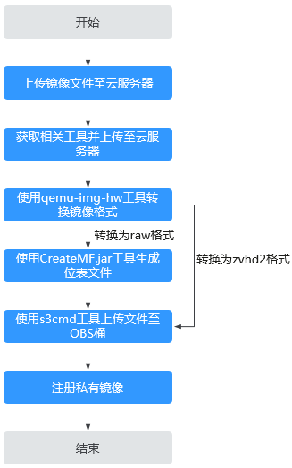

# 流程概览

如果外部镜像文件大小大于128GB，可以使用快速导入功能进行导入。但是有如下两个限制：仅支持raw和zvhd2格式；镜像文件大小不能超过1TB。

## 导入方案

请根据您的镜像文件格式来选择合适的导入方案：

-   若文件格式为**zvhd2**，则导入方案为：镜像文件优化 \> 上传至OBS桶 \> 在云平台注册
-   若文件格式为**raw**，则导入方案为：镜像文件优化 \> 生成镜像文件的位表文件 \> 将镜像文件和位表文件一同上传至OBS桶 \> 在云平台注册
-   若文件为**zvhd2**和**raw**以外的格式，导入时区分以下两种情况：
    -   镜像文件优化 \> 转换镜像文件格式为zvhd2 \> 将镜像文件上传至OBS桶 \> 在云平台注册
    -   镜像文件优化 \> 转换镜像文件格式为raw，并生成镜像文件的位表文件 \> 将镜像文件和位表文件一同上传至OBS桶 \> 在云平台注册

> **说明：**   
>-   快速导入也称大文件导入。大文件在导入时依赖延迟加载特性，zvhd2格式已支持该特性；raw格式不支持，需要依赖位表文件，因此在上传时，需要连同位表文件一起上传。  
>-   镜像文件优化的指导参考：[优化过程（Windows）](优化过程（Windows）.md)或者[优化过程（Linux）](优化过程（Linux）.md)，根据镜像文件的操作系统类型来选择。  

## 导入流程

我们以外部镜像文件格式为**zvhd2**和**raw**以外的场景为例，介绍完整的导入流程。

转换镜像格式时，可以使用快速导入工具中的qemu-img-hw，也可以使用开源工具qemu-img。qemu-img-hw仅适用于Linux操作系统，因此我们提供了基于Linux和Windows操作系统环境的导入指导。

> **说明：**   
>快速导入工具中包含两个子工具，分别实现两项功能：qemu-img-hw（镜像格式转换）、CreateMF.jar（生成位表文件）。  

-   基于Linux操作系统环境

    推荐使用云平台的EulerOS云服务器作为操作的环境，流程如[图1](#fig1082719127448)所示。

    **图 1**  导入流程（基于Linux操作系统环境）  
    

    详细操作请参见[快速导入镜像文件（基于Linux环境）](快速导入镜像文件（基于Linux环境）.md)。

-   基于Windows操作系统环境

    推荐使用Windows系统本地PC作为操作的环境，流程如[图2](#fig0232738181819)所示。

    > **说明：**   
    >开源镜像转换工具qemu-img不支持将镜像文件转换为zvhd2格式，因此需要转换为raw格式，再使用CreateMF.jar生成位表文件。  

    **图 2**  导入流程（基于Windows操作系统环境）  
    

    详细操作请参见[快速导入镜像文件（基于Windows环境）](快速导入镜像文件（基于Windows环境）.md)。

