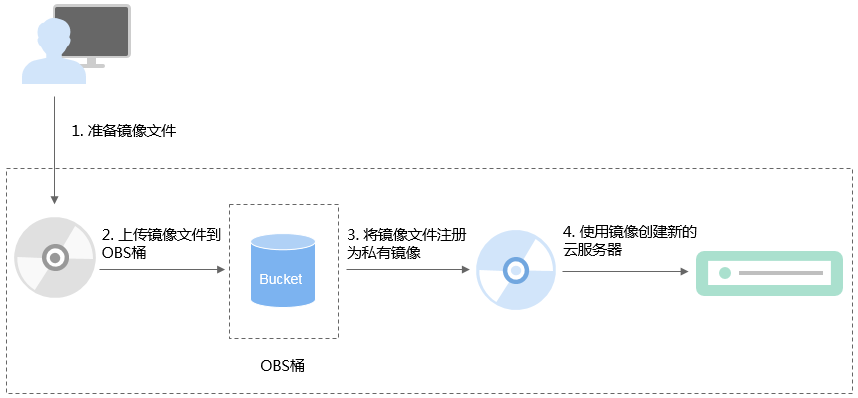

# 流程概览（Windows）

除了可以通过云服务器创建私有镜像，系统也支持外部镜像导入功能，可将您本地或者其他云平台的服务器系统盘镜像文件导入至镜像服务私有镜像中。导入后，您可以使用该镜像创建新的云服务器，或对已有云服务器的系统进行重装。

## 创建过程

私有镜像创建过程如[图1](#fig178711229102512)所示。

**图 1**  Windows系统盘镜像创建过程  

步骤说明如下：

1.  准备符合平台要求的外部镜像文件，请参考[准备镜像文件（Windows）](准备镜像文件（Windows）.md)。
2.  上传外部镜像文件到OBS个人桶中，请参考[上传镜像文件（Windows）](上传镜像文件（Windows）.md)。
3.  通过管理控制台选择上传的镜像文件，并将镜像文件注册为私有镜像，请参考[注册镜像（Windows）](注册镜像（Windows）.md)。
4.  私有镜像注册成功后，使用该镜像创建新的云服务器，请参考[使用镜像创建弹性云服务器（Windows）](使用镜像创建弹性云服务器（Windows）.md)。

