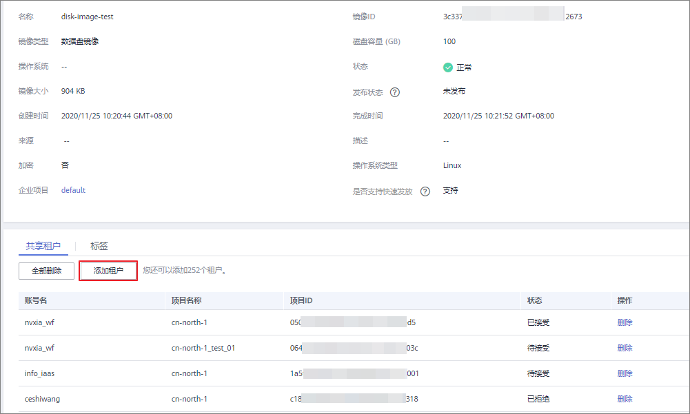

# 添加镜像的共享租户

## 操作场景

用户可以为共享镜像添加新的共享租户。

## 前提条件

-   用户有已共享的私有镜像。
-   用户已获取要添加的共享租户的项目ID。

## 操作步骤

1.  登录IMS控制台。
    1.  登录管理控制台。
    2.  选择“计算 \> 镜像服务”。

        进入镜像服务页面。

2.  单击“私有镜像”页签进入镜像列表页面。
3.  单击镜像名称，进入镜像详情页面。
4.  单击“添加租户”。

    **图 1**  镜像详情  
    

5.  在“添加租户”窗口，输入新增共享租户的项目ID，单击“确定”。

    如果需要添加多个共享租户，请输入新增共享租户的项目ID，并使用英文逗号间隔。单击“确定”，完成共享租户的添加。

