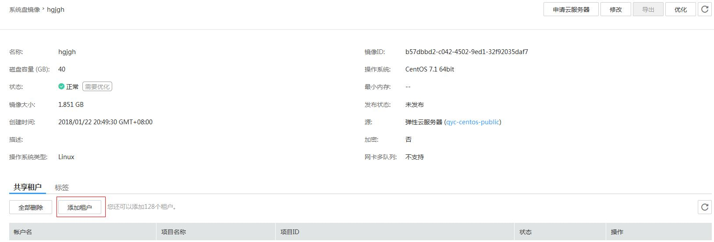

# 添加镜像的共享租户

## 操作场景

用户可以为共享镜像添加新的共享租户。

## 前提条件

-   用户有已共享的私有镜像。
-   用户已获取要添加的共享租户的帐户名（如果该共享租户是专属云用户或多项目用户，需要获取该共享租户的帐户名称和项目名称）。

## 操作步骤

1.  登录管理控制台。
2.  单击“计算”下的“镜像服务”。
3.  在“镜像”列表页面，单击“私有镜像”进入对应的镜像列表。
4.  单击镜像名称查看镜像详情。
5.  在镜像详情页面，单击“添加租户”。如[图1](#fig14925547164132)所示。

    **图 1**  镜像详情  
    

6.  在“添加租户”窗口，输入新增共享租户的帐户名（如果新增共享租户为专属云用户或多项目用户，多项目用户，请输入对应的项目名称），单击“添加”。

    如果需要添加多个共享租户，请输入新增共享租户的帐户名（如果新增共享租户为专属云用户或多项目用户，请输入对应的项目名称），单击“添加”。

