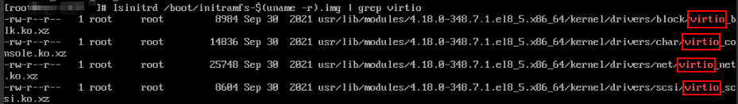

# 确认是否需要优化私有镜像

-   若当前云服务器为XEN虚拟化类型，需要优化。
-   若当前云服务器为KVM虚拟化类型，且未包含virtio驱动，需要优化。
-   若当前云服务器为KVM虚拟化类型，且包含virtio驱动，不需要优化。

## 操作步骤

1.  您可以执行以下命令，查看当前云服务器的虚拟化类型。

    **lscpu**

    -   如果回显信息中的Hypervisor vendor为XEN，说明当前云服务器为XEN虚拟化类型，请按照[私有镜像优化过程](优化过程（Linux）.md#section862461118288)对私有镜像进行优化。
    -   如果回显信息中的Hypervisor vendor为KVM，说明当前云服务器为KVM虚拟化类型。请根据步骤2进一步判断是否需要优化。

    **图 1**  查看Linux云服务器虚拟化类型  
    

2.  运行以下命令，确认当前系统是否包含virtio驱动。

    **lsinitrd /boot/initramfs-$\(uname -r\).img | grep virtio**

    -   如图所示，表示已经包含了virtio驱动，您可以直接导入私有镜像，无须优化私有镜像。更多信息，请参见[通过外部镜像文件创建Linux系统盘镜像](通过外部镜像文件创建Linux系统盘镜像.md)。

        

    -   如果没有包含virtio驱动，请按照[私有镜像优化过程](优化过程（Linux）.md#section862461118288)对私有镜像进行优化。

