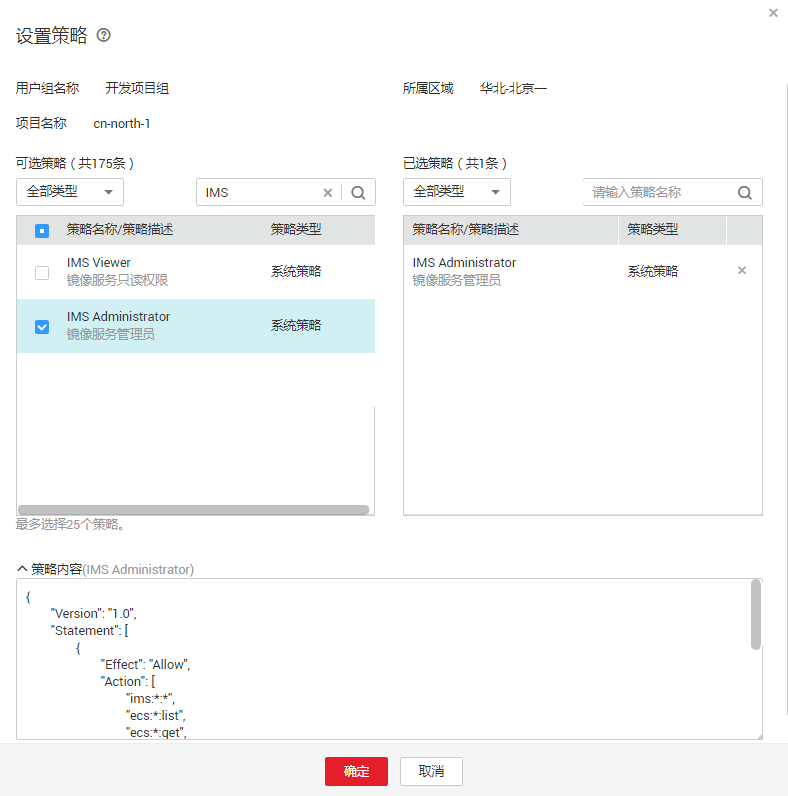

# 策略语法：RBAC<a name="ims_01_0417"></a>

## 策略结构<a name="section34932531871"></a>

策略结构包括：策略版本号（Version）、策略授权语句（Statement）和策略依赖（Depends）。

**图 1**  策略结构<a name="fig7645155318710"></a>  


## 策略语法<a name="section550418531971"></a>

如下以IMS服务的“IMS Administrator”为例，说明RBAC策略语法。

**图 2**  IMS Administrator策略<a name="fig19127191791118"></a>  


```
{
        "Version": "1.0",
        "Statement": [
                {
                        "Effect": "Allow",
                        "Action": [
                                "ims:*:*",
                                "ecs:*:list",
                                "ecs:*:get",
                                "evs:*:get"
                        ]
                }
        ],
        "Depends": [
                {
                        "catalog": "OBS",
                        "display_name": "Tenant Administrator"
                }
        ]
}
```

<a name="table450811531172"></a>
<table><thead align="left"><tr id="row2646953272"><th class="cellrowborder" colspan="2" valign="top" id="mcps1.1.5.1.1"><p id="p1264695310720"><a name="p1264695310720"></a><a name="p1264695310720"></a>参数</p>
</th>
<th class="cellrowborder" valign="top" id="mcps1.1.5.1.2"><p id="p13646353378"><a name="p13646353378"></a><a name="p13646353378"></a>含义</p>
</th>
<th class="cellrowborder" valign="top" id="mcps1.1.5.1.3"><p id="p1646175310717"><a name="p1646175310717"></a><a name="p1646175310717"></a>值</p>
</th>
</tr>
</thead>
<tbody><tr id="row18646653876"><td class="cellrowborder" colspan="2" valign="top" headers="mcps1.1.5.1.1 "><p id="p136461153579"><a name="p136461153579"></a><a name="p136461153579"></a>Version</p>
</td>
<td class="cellrowborder" valign="top" headers="mcps1.1.5.1.2 "><p id="p664685317712"><a name="p664685317712"></a><a name="p664685317712"></a>策略的版本</p>
</td>
<td class="cellrowborder" valign="top" headers="mcps1.1.5.1.3 "><p id="p86461553879"><a name="p86461553879"></a><a name="p86461553879"></a>固定为“1.0”</p>
</td>
</tr>
<tr id="row156465531710"><td class="cellrowborder" rowspan="2" valign="top" width="17.17171717171717%" headers="mcps1.1.5.1.1 "><p id="p106461653279"><a name="p106461653279"></a><a name="p106461653279"></a>Statement</p>
</td>
<td class="cellrowborder" valign="top" width="17.17171717171717%" headers="mcps1.1.5.1.1 "><p id="p2064635316710"><a name="p2064635316710"></a><a name="p2064635316710"></a>Action</p>
</td>
<td class="cellrowborder" valign="top" width="28.28282828282828%" headers="mcps1.1.5.1.2 "><p id="p464685310713"><a name="p464685310713"></a><a name="p464685310713"></a>定义对IMS的具体操作。</p>
</td>
<td class="cellrowborder" valign="top" width="37.37373737373737%" headers="mcps1.1.5.1.3 "><p id="p186461536714"><a name="p186461536714"></a><a name="p186461536714"></a>格式为：服务名:资源类型:操作</p>
<p id="p126467538715"><a name="p126467538715"></a><a name="p126467538715"></a>"ims:*:*"，表示对IMS的所有操作，其中IMS为服务名称；“*”为通配符，表示对所有的资源类型可以执行所有操作。</p>
</td>
</tr>
<tr id="row9646353279"><td class="cellrowborder" valign="top" headers="mcps1.1.5.1.1 "><p id="p26461531378"><a name="p26461531378"></a><a name="p26461531378"></a>Effect</p>
</td>
<td class="cellrowborder" valign="top" headers="mcps1.1.5.1.1 "><p id="p116461453372"><a name="p116461453372"></a><a name="p116461453372"></a>定义Action中所包含的具体操作是否允许执行。</p>
</td>
<td class="cellrowborder" valign="top" headers="mcps1.1.5.1.2 "><a name="ul196461253273"></a><a name="ul196461253273"></a><ul id="ul196461253273"><li>Allow：允许执行。</li><li>Deny：不允许执行。</li></ul>
</td>
</tr>
<tr id="row464718531173"><td class="cellrowborder" rowspan="2" valign="top" width="17.17171717171717%" headers="mcps1.1.5.1.1 "><p id="p16471553877"><a name="p16471553877"></a><a name="p16471553877"></a>Depends</p>
</td>
<td class="cellrowborder" valign="top" width="17.17171717171717%" headers="mcps1.1.5.1.1 "><p id="p136478531579"><a name="p136478531579"></a><a name="p136478531579"></a>catalog</p>
</td>
<td class="cellrowborder" valign="top" width="28.28282828282828%" headers="mcps1.1.5.1.2 "><p id="p166471853477"><a name="p166471853477"></a><a name="p166471853477"></a>依赖的策略的所属服务。</p>
</td>
<td class="cellrowborder" valign="top" width="37.37373737373737%" headers="mcps1.1.5.1.3 "><p id="p36471853577"><a name="p36471853577"></a><a name="p36471853577"></a>服务名称</p>
<p id="p1164795317720"><a name="p1164795317720"></a><a name="p1164795317720"></a>例如：OBS</p>
</td>
</tr>
<tr id="row17647953979"><td class="cellrowborder" valign="top" headers="mcps1.1.5.1.1 "><p id="p56475536711"><a name="p56475536711"></a><a name="p56475536711"></a>display_name</p>
</td>
<td class="cellrowborder" valign="top" headers="mcps1.1.5.1.1 "><p id="p176471853772"><a name="p176471853772"></a><a name="p176471853772"></a>依赖的策略的名称。</p>
</td>
<td class="cellrowborder" valign="top" headers="mcps1.1.5.1.2 "><p id="p6647195311717"><a name="p6647195311717"></a><a name="p6647195311717"></a>权限名称</p>
<p id="p116475539711"><a name="p116475539711"></a><a name="p116475539711"></a>例如：Tenant Administrator</p>
</td>
</tr>
</tbody>
</table>

