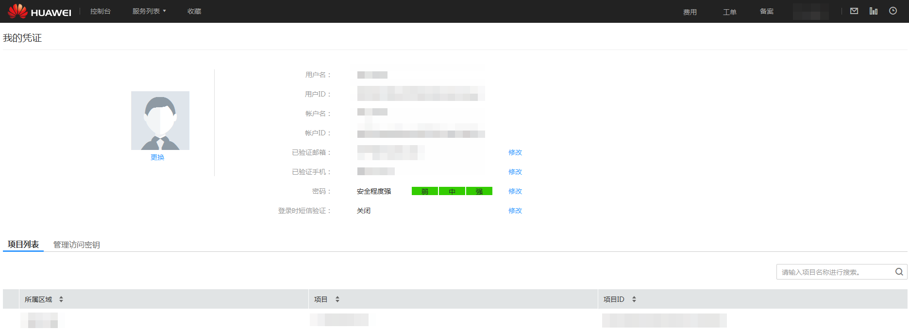

# 获取帐户名和项目名称

## 操作场景

用户A将私有镜像共享给用户B之前，用户B将自己的帐户名提供给用户A。如果用户B为专属云用户或多项目用户，还需要额外提供项目名称。本节指导用户B获取帐户名和项目名称。

## 操作步骤

1.  用户B登录管理控制台。
2.  单击右上角的用户名，在下拉列表中单击“我的凭证”。

    在“我的凭证”页面的项目列表中查看帐户名和项目名称。

**图 1**  查看账户名和项目名称  

