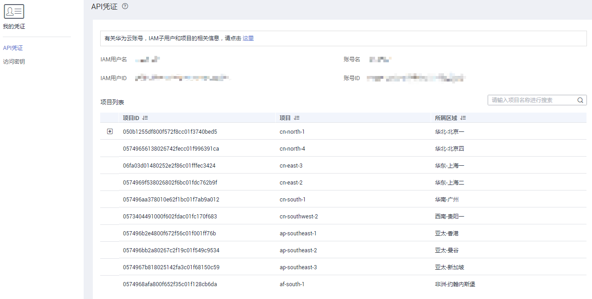

# 获取账号名和项目名称

## 操作场景

用户A将私有镜像共享给用户B之前，用户B将自己的账号名提供给用户A。如果用户B为专属云用户或多项目用户，还需要额外提供项目名称。本节指导用户B获取账号名和项目名称。

## 操作步骤

1.  用户B登录管理控制台。
2.  鼠标悬停在右上角的用户名，选择下拉列表中的“我的凭证”。

    在“API凭证”页面的项目列表中查看账号名和项目名称（即“项目”列取值）。

    **图 1**  查看账号名和项目名称  
    

