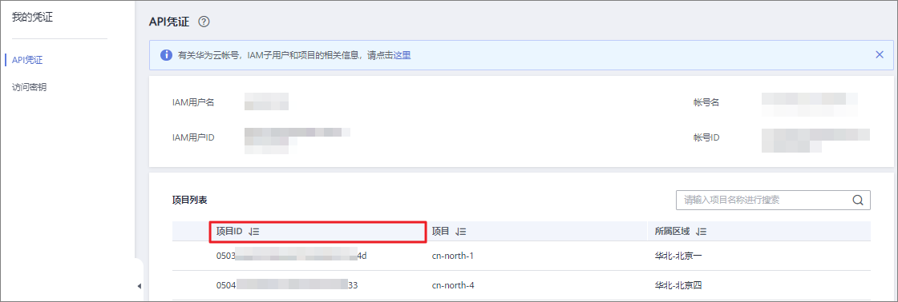

# 获取项目ID

## 操作场景

用户A将私有镜像共享给用户B之前，用户B将自己的项目ID提供给用户A。

## 操作步骤

1.  用户B登录IMS控制台。
    1.  登录管理控制台。
    2.  选择“计算 \> 镜像服务”。

        进入镜像服务页面。

2.  单击右上角的用户名，选择下拉列表中的“我的凭证”。

    在“我的凭证”页面的项目列表中查看项目ID。

    **图 1**  查看项目ID  
    

